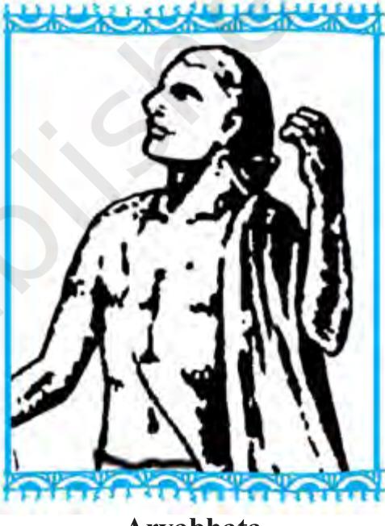
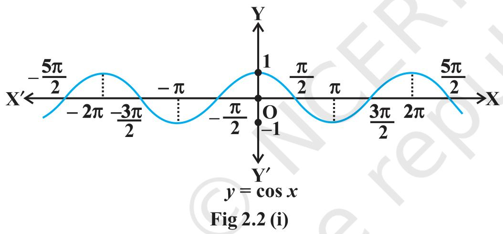
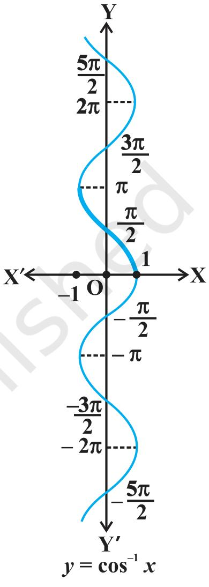

## INVERSE TRIGONOMETRIC FUNCTIONS

Mathematics, in general, is fundamentally the science $o f$ self-evident things — FELIX KLEIN

## 2.1 Introduction

In Chapter 1, we have studied that the inverse of a function $f,$ denoted by $f^{-1}$ , exists if fis one-one and onto. There are many functions which are not one-one, onto or both and hence we can not talk of their inverses. In Class XI, we studied that trigonometric functions are not one-one and onto over their natural domains and ranges and hence their inverses do not exist. In this chapter, we shall study about the restrictions on domains and ranges of trigonometric functions which ensure the existence of their inverses and observe their behaviour through graphical representations. Besides, some elementary properties will also be discussed.

$$
\begin{array} {c} {\mathrm{A r y a b h a t a}} \\ {( 4 7 6 \mathrm{-5 5 0 ~ A. ~ D.} )} \\ \end{array}
$$

The inverse trigonometric functions play an important role in calculus for they serve to define many integrals.

ivesetrionomricfinctins sal usedinsceneand nginern

## 2.2 Basic Concepts

In Class $\mathrm{X I}$ we avesnudedtigonomericfnions, wichaedefined a folos:

sine function, i.e., sine : $\mathbf{R} \to[-1, 1 ]$ 
cosine function, i.e., cos : $\mathbf{R} \to[-1, \, 1 ]$ 
tangent function, i.c., t
$$
\operatorname{a n} : \mathbf{R}-\{x : x=( 2 n+1 ) \, \, \frac{\pi} {2} \,, n \in\mathbf{Z} \} \to\mathbf{R}
$$
cotangent function, ice., cot : $\mathbf{R}-\{\mathbf{x} : x=n \pi, \mathbf{} n \in\mathbf{Z} \} \to\mathbf{R}$ 
secant function, i.e., sec $: \mathbf{R}-\{\, x : x=( 2 n+1 ) \, \, \frac{\pi} {2} \,, \, n \in\mathbf{Z} \} \to\mathbf{R}-(-1, \, 1 )$ cosecant function, i.e., cosec $: \mathbf{R}-\{x : x=n \pi, \, \, \, n \in\mathbf{Z} \} \to\mathbf{R}-(-1, \, 1 )$ restricted to any of the intervals 0 , . i r. 2 i etc., is iecivce with range as $[-1, \, 1 ]$ . We can, therefore, define the inverse of cosine function in each of these intervals. We denote the inverse of the cosine function by cos (arc cosine function),

Since, cosec $x=\frac{1} {\operatorname{s i n} x}$ , the domain of the cosec function is the set $\{x : x \in{\bf R}$ and X≠ nT, $n \in{\bf Z} \}$ and the range is the set $\{y : y \in{\bf R}$ , $y \geq1$ or $y \leq-1 \} \mathrm{~ i. e.}$ , the set $R-(-1, ~ 1 )$ . It means that $y=$ cosec $x$ assumes all real values except $- 1 < y < 1$ and is not defined for integral multiple of $\pi$ . If we restrict the domain of cosec function to
 $\left[-\frac{\pi} {2}, \frac{\pi} {2} \right]$ -{0}, then itis one to one and onto with it range as the set $\mathbf{R-} (-1, 1 )$ Atually,
cosec function restricted to any of the i
$$
\mathrm{n t e r v a l s} \, \left[ \frac{-3 \pi} {2}, \frac{-\pi} {2} \right] \!-\{-\pi\} \,, \, \left[ \frac{-\pi} {2}, \frac{\pi} {2} \right]-\{0 \},
$$
$$
\left[ \frac{\pi} {2}, \frac{3 \pi} {2} \right] \!-\left\{\pi\right\}_{\mathrm{\scriptsize~ e t c., ~ i s ~ b i j e c t i v e ~ a n d ~ i t s ~ r a n g e ~ i s ~ t h e ~ s e t ~ o}}
$$
 $R-(-1, ~ 1 )$ .
ali ea numbrs

Thus, cosl is a function whose domain is [-1, 1] and range could be any of the intervals [-n, 0], [O, t], [r, 2t] etc. Corresponding to each such interval, we get a branch of the function cos -. The branch with range $[ 0, \pi]$ is called the principal value branch of the function cosl. We write

$$
\operatorname{c o s}^{-1} : [-1, \, 1 ] \to[ 0, \, \pi].
$$

The graph of the function given $y=\operatorname{c o s}^{-1} x$ can be drawn in the same way as discussed about the graph of y = sin- x. The
givenin Fig $2. 2 \mathrm{~ ( i )}$ and (i)

Let us now discuss and sec-'x as follows:

$$
\mathrm{F i g ~ 2. 2 ~ ( i i )}
$$

