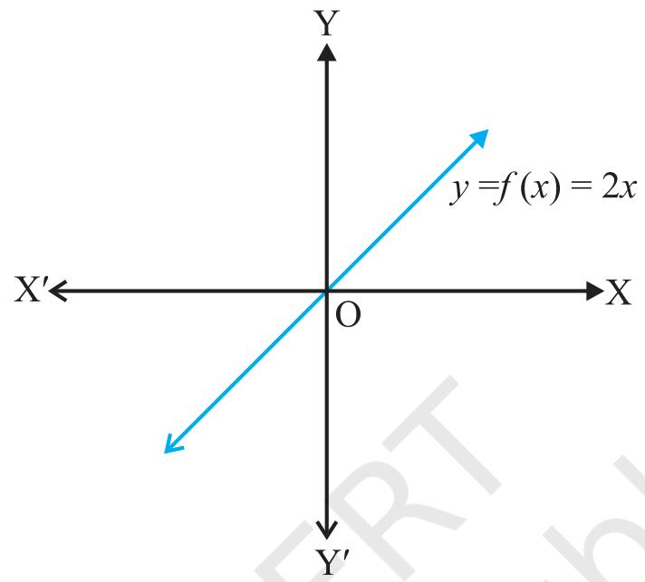

## RELATIONS AND FUNCTIONS

There is no permanent place in the world for ugly mathematis. ... . $x_{t}$ may be very hard to define mathematical beauty but that is just as true of
beauty of any kind, we may not know quite what we mean by a
beautiful poem, but that does not prevent us from recognising
one when we read it. $- G$ . H. HARDY

(i） $\{( a, b ) \in\mathrm{A} \times\mathrm{B} \colon a$ is brother of $b \}$ , Leseune Dirichlet i $\{( a, b ) \in\mathrm{A} \times\mathrm{B} \colon a$ is sister $\mathrm{o f ~} b \}$ , (1805-1859)
(ill） $\{( a, \, b ) \in\mathrm{A} \times\mathrm{B}$ : age of ${\it a}$ is greater than age of $b \}$ ,
(iv） $\{( a, \, b ) \in\mathrm{A} \times\mathrm{B}$ : total marks obtained by ${\it a}$ in the final examination is less than
the total marks obtained by $\it b$ in the final examination},
 $\{( a, b ) \in\mathrm{A} \times\mathrm{B} \colon a$ lives in the same locality as $b \}$ . However, abstracting from
this, we define mathematically a relation $\mathtt{R}$ from $\mathrm{A}$ to $\mathrm{B}$ as an arbitrary subset
of $\mathrm{A} \times\mathrm{B}$ .

(iv） $\{( a, \, b ) \in\mathrm{A} \times\mathrm{B}$ : total marks obtained by ${}^{a}$ in the final examination is less than the total marks obtained 7 $\it b$ in the final examination
by

(v） $\{( a, b ) \in\mathrm{A} \times\mathrm{B} \colon a$ lives in the same locality as $b \}$ . However, abstracting from this, we define mathematically a relation $\mathrm{\mathrm{R}}$ from A to $\mathrm{B}$ as an arbitrary subset of $\mathrm{A} \times\mathrm{B}$ 

 $\mathrm{I f} \left( a, \, b \right) \in\mathrm{R}$ , we say that ${\it a}$ is related to $\it b$ under the relation $\mathtt{R}$ and we write as a $\textrm{R} b$ . In general, $( a, \, b ) \in\mathrm{R}$ , we do not bother whether there is a recognisable connection or link between ${\it a}$ and $\it b$ . As seen in Class XI, functions are special kind of relations.

In this chapter, we willstudy different types of relations and functions, composition of functions, invertible functions and binary operations.

## 1.1 Introduction

Recall that the notion of relations and functions, domain, co-domain and range have been introduced in Class XI along with different types of specific real valued functions and their graphs. The concept of the term relation' in mathematics has been drawn from the meaning of relation in English language, according to which two objects or quantities are related if there is a recognisable connection or link between the two objects or quantities. Let A be the set of students of Class XII of a school and B be the set of students of Class XI of the same school. Then some of the examples of relations from $\mathrm{A ~ t o ~ B}$ arc

(i） $\{( a, \, b ) \in\mathrm{A} \times\mathrm{B}$ : age of ${\it a}$ is gratrtan ge $\mathrm{o f ~} b \}$ .

$$
\begin{array} {c} {\mathrm{L e j e u n e ~ D i r i c h l e t}} \\ {( 1 8 0 5-1 8 5 9 )} \\ \end{array}
$$

## 1.2 Types of Relations

In this section, we would like to study different types of relations. We know that a relation in a set $\mathrm{A}$ is a subset of $\mathrm{A} \times\mathrm{A}$ . Thus, the empty set $\Phi$ and $\mathrm{A} \times\mathrm{A}$ are two extreme relations. For illustration, consider a relation $\mathtt{R}$ in the set $\mathrm{A}=\{1, 2, 3, 4 \}$ given by
$$
\mathrm{R}=\{( a, b ) ; a-b=1 0 \}
$$
. This is the empty set, as no pair $( a, b )$ satisfies the condition
 $a-b=1 0$ . Similarly, $\mathbf{R}^{\prime}=\{( a, \, b ) : \mid a-b \mid\geq0 \}$ is the whole set $\mathrm{A} \times\mathrm{A}$ , as all pairs $( a, \, b )$ in $\mathrm{A} \times\mathrm{A}$ satisfy $a-b \mid\geq0$ . These two extreme examples lead us to the following definitions.

Definition 1 A relation $\mathtt{R}$ in set A is called empty relation, if no element of A is related to any element of $\mathrm{A}$ , i., $\mathrm{R}=\phi\subset\mathrm{A} \times\mathrm{A}.$ 

Definition $2$ A relation R in a set $\mathrm{A}$ is called universal relation, if each element of A is related to every element of A, i.e., $\mathrm{R}=\mathrm{A} \times\mathrm{A}$ .

Both the empty relation and the universal relation are some times called trivial relations.

Example 1 Let A be the set of all students of a boys school. Show that the relation $\mathtt{R}$ in A given by $\mathrm{~ R}=\{( a, b )$ : ${\it a}$ is sister of $b \}$ is the empty relation and $\mathbf{R}^{\prime}=\{( a, b )$ : the difference between heights of ${\it a}$ and $\it b$ is less than 3 meters} is the universal relation

Solution Since the school is boys school, no student of the school can be sister of any student of the school. Hence, $\mathbf{R}=\phi,$  showing that R is the empty relation. It is also obvious that the difference between heights of any two students of the school has to be less than ${}_{3}$ meters. This shows that $\mathbf{R}^{\prime}=\mathbf{A} \times\mathbf{A}$ is the universal relation.

Remark In Class XI, we have seen two ways of representing a relation, namely raster
 $\{1, 2, 3, 4 \}$ defined by R method and set builder method. However, a relation R in the set
 $= ~ \{( a, ~ b ) ~ : ~ b ~=~ a ~+~ 1 \}$ is also expressed as ${\it a}$  $\mathtt{R}$  $\it b$ if and only if $b=a+1$ by many authors. We may also use this notation, as and when convenient

 $\mathrm{I f \,} ( a, b ) \in\mathbb{R}$ , we say that ${\it a}$ is related to $\it b$ and we denote it as $a \textrm{r r e} b$ .

One of the most important relation, which plays a significant role in Mathematics, is an equivalence relation. To study equivalence relation, we first consider three types of relations, namely reflexive, symmetric and transitive

Definition 3 A relation R in a set A is called

(i)reflexive, $\mathrm{i f ~} ( a, \, a ) \in\mathbb{R}$ ,for every $a \in\mathrm{A}$ .
(in symmetric, if $( a_{1}, a_{2} ) \in\mathrm{R}$ implies that $( a_{2}, \, a_{1} ) \in\mathbb{R}$ for al $a_{1}, \, a_{2} \in\mathrm{A}.$ 
(iitrasitie,i $\mathrm{f} \left( a_{1}, a_{2} \right) \in\mathrm{R}$ and $( a_{2}, a_{3} ) \in\mathbb{R}$ implies that $( a_{1}, a_{3} ) \in\mathrm{R}$ foral $a_{1}, a_{2},$ 
 $a_{3} \in\mathrm{A}$ .

Definition $4 \mathrm{~ A}$ relation $\mathtt{R}$ in a set $\mathrm{A}$ is said to be an equivalence relation if R is reflexive, symmetric and transitive.

Example $2$ Let $\mathrm{T}$ be the set of all triangles in a plane with $\mathtt{R}$ a relation in $\mathrm{T}$ given by $\mathrm{R}=\{( \mathrm{T}_{\sb1}, \mathrm{T}_{\sb2} ) : \mathrm{T}_{\sb1}$ is congruent to $\mathrm{T}_{2} \}$ . Show tht R is an equivalence relation.

Solution $\mathtt{R}$ is reflexive, since every triangle is congruent to itself. Further $\mathrm{\mathrm{R}}$ is symetric. Mreover, 5 $( \mathrm{T}_{1}, \, \mathrm{T}_{2} ), \, ( \mathrm{T}_{2}, \, \mathrm{T}_{3} ) \in\mathrm{R} \Rightarrow\mathrm{T}_{1}$ MedNe $\mathtt{R}$  $\mathrm{T}_{1} \Rightarrow( \mathrm{T}_{2}, \mathrm{T}_{1} ) \in\mathrm{R}$  $\mathrm{T}_{2}$ , and $\mathrm{T_{2}}$ 1S $( \mathrm{T}_{\i}, \mathrm{T}_{\i} ) \in\mathrm{R} \Rightarrow\mathrm{T}_{\i}$ is congruent to $\mathrm{T}_{2} \Rightarrow\mathrm{T}_{2}$ is congruent to . Hence
congruent to
congruent to $\mathrm{T_{3} \Rightarrow T_{1}}$ is congruent to $\mathrm{T_{3}} \Rightarrow( \mathrm{T}_{\sb1}, \mathrm{T}_{\it3} ) \in\mathrm{R}.$ is an equivalence relation.

Example 3 Let L be the set of all lines in a plane and R be the relation in $\mathrm{L}$ defined as $\mathrm{\boldmath~ R ~}=\{( \mathrm{L}_{\sb1}, \mathrm{~ L}_{\sb2} ) : \mathrm{~ L}_{\sb1}$ is perpendicular to $\mathrm{L}_{2}^{\vphantom{\rho}} \}$ . Show that $\mathrm{\mathrm{R}}$ is symmetric but neither reflexive nor transitive.

Solution $\mathtt{R}$ is not reflexive, as a line $\mathbf{L}_{1}$ can not be perpenducuar toisl, i., $( \mathrm{L}_{\i}, \mathrm{L}_{\i} )$ e R. R is symmetric as $( \mathrm{L}_{1}, \mathrm{L}_{2} ) \in\mathrm{R}$ -L,

→ $\mathrm{L}_{\i}$ is perpendicular to 2 → $\mathrm{L}_{2}$ is perpendicular $\mathrm{t o ~ L}_{\i}$ =→ (, L) e R

$$
\mathrm{L_{1} ~ i s ~ p e r p e n d i c u l a r ~ t o ~ L_{2} ~}
$$

$$
\mathrm{L_{2} ~ i s ~ p e r p e n d i c u l a r ~ t o ~ L_{1} ~}
$$

$$
( \mathrm{L}_{2}, \mathrm{L}_{1} ) \in\mathrm{R}.
$$

R is not transitive. Indeed, if L, is perpendicular to $\mathrm{L}_{2}$ and is perpendicular to ${\bf L}_{{}_{3}},$ then $\mathrm{L}_{1}$ can never be perpendicuar to

$$
\mathrm{F i g \ 1. 1}
$$

in fact, $\mathbf{L}_{\mathrm{1}}$ is al to
$$
\mathrm{~ L_{3} ~}, \mathrm{~ i. e., ~} ( \mathrm{~ L_{\sb1} ~}, \mathrm{~ L_{\sb2} ~} ) \in\mathrm{~ R ~}, \mathrm{~ ( L_{\sb2} ~}, \mathrm{~ L_{\sb3} ) ~} \in\mathrm{~ R ~ b u t ~} ( \mathrm{~ L_{\sb1} ~}, \mathrm{~ L_{\sb3} ~} ) \notin\mathrm{~ I}
$$

e $\angle$ Show that the relation R in the set $\{1, 2, 3 \}$ given by $\mathrm{R}=\{( 1, \, 1 ), \, ( 2, \, 2 ),$ Example
 $( 3, 3 ), ( 1, 2 ), ( 2, 3 ) \}$ is reflexive but neither symmetric nor transitive

Solution $\mathrm{\mathrm{R}}$ is reflexive, since $( 1, 1 ), ( 2, 2 )$ and 3,3) lie in $\mathtt{R}$ . Also, Ris notsmetric, as $( 1, 2 ) \in\mathrm{R}$ but (2, 1) g R. Similarly, R is not transitive, as $( 1, 2 ) \in\mathrm{R}$ and $( 2, 3 ) \in\mathrm{R}$ but $( 1, 3 ) \notin\mathrm{R}$ .

Example s Sho wtat the relation $\mathrm{\mathrm{R}}$ in the set ${\bf Z}$ of integers given by

$$
\mathrm{R}=\{( a, \, b ) : 2 \mathrm{~ d i v i d e s ~} a-b \}
$$

$$
\mathrm{i s ~ a n ~ e q u i v a l e n c e ~ r e l a t i o n.}
$$

Solution $\mathtt{R}$ is reflexive, as $2$ divides $( a-a )$ for all $a \in{\bf Z}$ . Further, i $( a, \, b ) \in\mathbb{R},$ then $2$ divides $a-b$ . Therefore, $2$ divides $b-a$ . Hence, $( b, a ) \in\mathbb{R}$ , which shows that $\mathtt{R}$ is symmetric. Similarly, if $( a, b ) \in\mathbb{R}$  $( b, c ) \in\mathbb{R}$ , then $a-b$ and $b-c$ are divisible by
and
 $2$ . Now, $a-c=( a-b )+( b-c )$ is even (Why?). So, $( a-c )$ is divisible by ${}_{2}$ . This shows that $\mathtt{R}$ is transitive. Thus, R is an cquivalence relation in ${\bf Z}$ -

In Example ${}_{5}$ , note that all even integers are related to zero, as $( 0, \pm2 ), ( 0, \pm4 )$ etc. lie in $\mathtt{R}$ and no odd integer is related to $0$ ,as $( 0, \pm1 ), ( 0, \pm3 )$ etc., do not lie in $\mathrm{\mathrm{R}}$ . Similarly, all odd integers are related to one and no even integer is related to one. Therefore, the set E of all even integers and the set $\mathrm{O}$ of all odd integers are subsets of ${\bf Z}$ satisfying following conditions:

(i) All elements of E are related to each other and all elements of O are related to
each other.
(i No clement of E is related to any element of O and vice-versa.
(ii $\mathrm{E}$ 1 $\mathrm{O}$ are disjoint and $\mathbf{Z}=\mathrm{E} \cup\mathrm{O}.$ 
and

The subset $\mathrm{E}$ is called the equivalence class containing zero and is denoted by [0]. Similarly, O is the equivalence class containing 1 and is denoted by [1]. Note that $[ 0 ] \neq[ 1 ], \, [ 0 ]=[ 2 r ]$ and $[ 1 ]=[ 2 r+1 ], \, r \in{\bf Z}$ . Infact, what we have seen above is true for an arbitrary equivalence relation $\mathtt{R}$ in a set $\mathrm{X}$ . Given an arbitrary equivalence relation $\mathtt{R}$ in an arbitrary set $\mathrm{X}$ , R divides $\mathrm{X}$ into mutually disjoint subsets $\mathrm{A}_{i}$ called partitions or subdivisions of $\mathrm{X}$ satisfying:

(i) all elements $\mathrm{o f \, A}_{i}$ are related to each other, for all $i.$ (i) no element $\mathrm{o f \, A}_{i}$ i l to any element ofA,, i ti.
is related
(ii） $\cup\mathbf{A}_{j}=\mathbf{X}$ and $\mathrm{A}_{i} \cap\mathrm{A}_{j}=\phi, \: i \neq j.$ 

(i)all elements of $\mathrm{A}$ , are related to cach other, for $\mathrm{\ a l l ~} i.$ 
I

s $\mathrm{A}_{i}$ are called equivalence classes. The interesting part of the situation The subsets
is that we can go reverse also. For example, consider a subdivision of the set ${\bf Z}$ given by three mutually d $\mathrm{A}_{1}, \mathrm{A}_{2}$ and $\mathrm{A}$ , whose union is ${\bf Z}$ with
disjoint subsets

$$
\begin{array} {l} {{\mathrm{A_{1}=\{x \in{\bf Z} : x ~ i s ~ a ~ m u l t i p l e ~ o f ~ 3 \}=\{...,-6,-3, ~ 0, ~ 3, ~ 6,... \}}}} \\ {{\mathrm{A_{2}=\{x \in{\bf Z} : x-1 ~ i s ~ a ~ m u l t i p l e ~ o f ~ 3 \}=\{...,-5,-2, ~ 1, ~ 4, ~ 7,... \}}}} \\ {{\mathrm{A_{3}=\{x \in{\bf Z} : x-2 ~ i s ~ a ~ m u l t i p l e ~ o f ~ 3 \}=\{...,-4,-1, ~ 2, ~ 5, ~ 8,... \}}}} \end{array}
$$

Define a relation R in ${\bf z}$ given by $\mathrm{\boldmath{R}}=\{( a, \, b )$ : 3 divides $a-b \}$ . Following the arguments similar to those used in Example $5$ , we can show that $\mathtt{R}$ is an equivalence relation. Also, $\mathrm{A}$ coincides with the set of all integers in ${\bf Z}$ which are related to zero, $\mathrm{A}_{2}$ coincides with the set of all integers which are related to $1$ and $\mathrm{A}_{{}_{3}}$ coincides with the
n ${\bf Z}$ which are related to $2$ . Thus, $\mathrm{~ A ~}_{1}=[ 0 ], \, \mathrm{~ A ~}_{2}=[ 1 ]$ and $\mathrm{A}_{3}=[ 2 ]$ . set of all integers in
In fact, $\mathrm{A}_{1}=[ 3 r ], \, \mathrm{A}_{2}=[ 3 r+1 ]$ and $\mathrm{A}_{3}=[ 3 r+2 ],$ for all $r \in{\bf Z}$ .
a

Example 6 Let $\mathtt{R}$ be the relation defined in the set $\mathrm{A}=\{1, \; 2, \; 3, \; 4, \; 5, \; 6, \; 7 \}$ by $\mathrm{\boldmath{R}}=\{( a, \, b )$ : both ${\it a}$ and $\it b$ a l or even}. Show that $\mathtt{R}$ is an equivalence
are either odd
 $\{1, 3, 5, 7 \}$ are related to each relation. Further, show that all the elements of the subset
other and all the elements of the subset $\{2, \, 4, \, 6 \}$ are related to each other, but no element of the subset $\{1, \, 3, \, 5, \, 7 \}$ is related to any element of the subset $\{2, 4, 6 \}$ . Solution Given any element ${\it a}$ in $\mathrm{A}$ , both $a$ and ${\it a}$ must be cither odd or even, so that $( a, \, a ) \in\mathrm{R}$ . Further, $( a, \, b ) \in\mathrm{R} \Rightarrow\mathrm{b o t}$ h $a$ and $\it b$ must be either odd or even $\Rightarrow( b, a ) \in\mathrm{R}$ . Similarly, $( a, \, b ) \in\mathbb{R}$ and $( b, \, c ) \in\mathrm{R} \Rightarrow$ all elements $a, \, b, \, c$ , must be either even or odd simultaneously $\Rightarrow( a, c ) \in\mathbb{R}$ . Hence, $\mathrm{\mathrm{R}}$ is an equivalence relation. Further, all the elements of $\{1, \, 3, \, 5, \, 7 \}$ are related to each other, as all the elements of this subset are odd. Similarly, all the elements of the subset $\{2, 4, 6 \}$ are related to each other, as all of them are even. Also, no element of the subset $\{1, \, 3, \, 5, \, 7 \}$ can be related to any element of $\{2, 4, 6 \}$ , as elements of $\{1, 3, 5, 7 \}$ are odd, while elements of $\{2, 4, 6 \}$ are even.

## EXERCISE 1.1

1. relations are reflexive, symmetric and
transitive:

i) Relation R in the set $\mathrm{A}=\{1, \, 2, \, 3, \,..., \, 1 3, \, 1 4 \}$ defined as
$$
\mathrm{R}=\{( x, y ) : 3 x-y=0 \}
$$
i) Relation R in the set $\mathbf{N}$ of natural numbers defined as
$$
\mathrm{R}=\{( x, y ) : y=x+5
$$
and $x < 4 \}$ 
(ii) Relation $\mathtt{R}$ in the set $\mathrm{A}=\{1, \, 2, \, 3, \, 4, \, 5, \, 6 \} \, \, \mathrm{a s}$ ;
$$
\mathrm{R}=\{( x, y ) : y
$$
is divisible by $x \}$ 
(iv) Relation $\mathtt{R}$ in the set ${\bf Z}$ of all integers defined as
 $\mathrm{R}=\{( x, y ) : x-y$ is an integer}
(v)Relation $\mathtt{R}$ in the set A of human beings in a town at a particular time given by
(a) R= {(x, ) : x and y work at the same place}
(b） $\mathrm{R}=\{( x, y ) : x$ and y live in the same locality}
(c) $\mathrm{R}=\{( x, y ) : x$ is exactly $7$ cm taller than y}
(d) $\mathrm{R}=\{( x, y ) : x$ is wife of y}
(e) ${\mathrm{\boldmath{R}}}=\{( x, y )$ : x is father of y}

(i) Relation R in the set $\mathrm{A}=\{1, \, 2, \, 3, \,..., \, 1 3, \, 1 4 \}$ defined as
$$
\mathrm{R}=\{( x, y ) : 3 x-y=0 \}
$$

$$
\mathrm{R}=\{( x, y ) : 3 x-y=0 \}
$$

(i）Relation $\mathtt{R}$ in the set $\mathbf{N}$ of natural numbers defined as

$$
\mathrm{R}=\{( x, y ) : y=x+5 \mathrm{~ a n d ~} x < 4 \}
$$

(ii Relation $\mathrm{\mathrm{R}}$ in the set $\mathrm{A}=\{1, 2, 3, 4, 5, 6 \}$ as

$$
\mathrm{R}=\{( x, y ) : y \mathrm{~ i s ~ d i v i s i b l e ~ b y ~} x \}
$$

(iv）Relation $\mathrm{\mathrm{R}}$ in the set ${\bf Z}$ ofall ners efined as

$$
\mathrm{R}=\{( x, y ) : x-y \mathrm{~ i s ~ a n ~ i n t e g e r} \}
$$

Relation $\mathtt{R}$ in the setA of human given

(a) $\mathrm{R}=\{( x, y ) : x$ and y work at the same place} (b） $\mathrm{R}=\{( x, y ) : x$ and $\boldsymbol{y}$ live in the same locality (c) $\mathrm{R}=\{( x, y ) : x$ is exactly $7$ cm taller than y} (d) $\mathrm{R}=\{( x, y ) : x$ is wife of y}
(e) ${\mathrm{R}}=\{( x, y )$ : $x$ is fatherof y

 $2$ .Show that the relation $\mathtt{R}$ in the set R of real numbers, defined as
 $\mathrm{R}=\{( a, \, b ) : a \leq b^{2} \}$ is neither reflexive nor symmetric nor transitive.

3. Check whether the relation $\mathtt{R}$ defined in the set $\{1, 2, 3, 4, 5, 6 \}$ as
$$
\mathrm{R}=\{( a, b ) : b=a+1 \}
$$
is reflexive, symeticor tasitive.

4. Show that the relation R in R defined as $\mathrm{R}=\{( a, \, b ) : a \leq b \}$ , is reflexive and transitive but not symmetric.

5. Check whether the relation $\mathtt{R}$ in R defined by $\mathrm{R}=\{( a, \, b ) : a \leq b^{3} \}$ is reflexive,
symmetric or transitive.

6. Show that the relation R in the set $\{1, \, 2, \, 3 \}$ given by $\mathrm{R}=\{( 1, \, 2 ), \, ( 2, \, 1 ) \}$ is symmetric but neither reflexive nor transitive.

7. Show that the relation $\mathtt{R}$ in the set $\mathrm{A}$ of all the books in a library of a college, given by $\mathrm{R}=\{( x, y ) : x$ and $\mathcal{Y}$ have same number of pages} is an cquivalence relation.

8. Show that the relation R in the set $\mathrm{A} \!=\{1, 2, 3, 4, 5 \}$ given by

 $\mathrm{R}=\{( a, \, b ) : | a-b |$ is even}, is an equivalence relation. Show that all the elements of $\{1, 3, 5 \}$ are related to each other and all the elements of $\{2, 4 \}$ are related to each other. But $\{1, 3, 5 \}$ element $\mathrm{o f ~ \{2, 4 \} ~}$ .
no element of is related to any

9. Sh

ow that each of the relation R in the set $\mathrm{A}=\{x \in{\bf Z} : 0 \leq x \leq1 2 \}, \, \mathrm{g i v e n ~ b y}$ 

(i) $\mathrm{R}=\{( a, b ) : | a-b |$ is a multiple of 4} (i $\mathrm{R}=\{( a, \, b ) : a=b \}$ 

san cauiaenerain n t s tofal lemen s tlal t ol inac cas

10. Giv an example of arelation. Which is

(i) Symmetric but neither reflexive nor transitive, lin Transitive but neither reflexive nor symmetric. (in Reflexive and symmetric but not transitive. (iv) Reflexive and transitive but not symmetric. Symmetric and transitive but not reflexive.

11. Show that the relation $\mathtt{R}$ in the set A of points in a plane given by $\mathrm{R}=\{( \mathrm{P, Q} )$ : distance of the point P from the origin is same as the distance of the
 $\mathsf{Q}$ from the origin}, is an equivalence relation. Further, show that the set of point
all points related to a point $\mathrm{P} \neq( 0, 0 )$ is the circle passing through $\mathtt{P}$ with origin as centre.

12. ho wthtre rtiaion eienini nthst fal tingles as $\mathrm{R}=\{( \mathrm{T}_{\sb1}, \mathrm{T}_{\sb2} ) : \mathrm{T}_{\sb1}$ is s $\mathrm{T}_{2} \}$ , is equivalence relation. Consider three right angle triangles $\mathrm{T_{1}}$ similar to
with sides 3, 4, 5, $\mathrm{T_{2}}$ with sides ${}_{5}$ , 12, 13 and $\mathrm{T_{_{3}}}$ with sides 6, $8$ , 10. Which triangles among $\mathrm{T}_{1}, \mathrm{T}_{2}$ and $\mathrm{T_{_{3}}}$ are related?

13. Show that the relation R defined in the set $\mathrm{A}$ of all polygons as ${\bf R}=\{( {\bf P}_{1}, \, {\bf P}_{2} )$  $\mathrm{P_{1}}$ and P, have same number of sides}, is an equivalence relation. What is the set of all elements in A related to the right angle triangle $\mathrm{T}$  $3,$ 4 and 5?
with sides

14. Let $\mathrm{L}$ be the set of all lines in $\mathrm{X Y}$ plane and $\mathtt{R}$ be the relation in $\mathrm{L}$ defined as $\mathrm{R}=\{( \mathrm{L}_{1}, \mathrm{L}_{2} ) : \mathrm{L}_{1}$ is parallel to $\mathrm{L}_{2} \}$ . Show that $\mathrm{\mathrm{R}}$ is an equivalence relation. Find the set of all lines related to the line $y=2 x+4$ .

15. Let R be the relation in the set $\{1, 2, 3, 4 \}$ given $\mathrm{R}=\{( 1, 2 ), ( 2, 2 ), ( 1, 1 ), ( 4, 4 ),$ 
by
 $( 1, \, 3 ), \, ( 3, \, 3 ), \, ( 3, \, 2 ) \}$ . Choose the correct answer

(A) $\mathtt{R}$ is reflexive and symmetric but not transitive. (B) $\mathtt{R}$ is reflexive and transitive but not symmetric (C) $\mathtt{R}$ is symmetric and transitive but not reflexive (D) $\mathtt{R}$ is an equivalence relation

16. Let R be the relation in the set $\mathbf{N}$ given by $\mathrm{R}=\{( a, b ) : a=b-2, b > 6 \}$ . Choose
the correct answer.

 $\mathrm{( A )} \ ( 2, 4 ) \in\mathrm{R}$ （B) $( 3, 8 ) \in\mathrm{R}$ (C) $( 6, 8 ) \in\mathrm{R}$ (D) $( 8, 7 ) \in\mathrm{R}$ 

## 1.3

The notion of a function along with some special functions like identity function, constant function, polynomial function, rational function, modulus function, signum function eto along with their graphs have been given in Class $\mathrm{X I}$ 

Addition, subtraction, multiplication and division oftwo functions have also been studied. As the concept of function is of paramount importance in mathematics and among other disciplines as well, we would like to extend our study about function from where we finished carlier. In this section, we would like to study different types of functions.

Consider the functions $f_{1}, f_{2}, f_{3}$ and $f_{4}$ gven ythe folowingdagams

In Fig $1. 2$ , we observe that the images of distinct elements $\mathrm{o f \, X_{1}}$ under the function $f_{1}$ namely $\it b$ distinct, but the image of two distinct elements $1 ~$ and $2$ of $\mathrm{X_{1}}$ under $f_{2}$ is same are 
. Further, there are some elements like $e$ and $f$ in $\mathrm{X_{{}_{2}}}$ which are not images of any element of $\mathrm{X_{1}}$ under $f_{1}$ , while all lements of $\mathrm{X_{{}_{3}}}$ are images of some elements of $\mathrm{X}$ under $f_{3}$ . The above observations lead to the following definitions

Definition 5 A function f: $\mathrm{X \! \to\!}$ Y is defined to be one-one (or ijective), if the images of distinct elements of $\mathrm{X}$ under $f$ are distinct, i.e., for every $x_{1}, \, x_{2} \, \in\, \mathrm{X}, f ( x_{1} )=f ( x_{2} )$ implies $x_{1}=x_{2}$ . Otherwise, $f$ is called mamy-one

m上卫业2doa心 $f_{1}$ and $f_{4}$ in i L1 21 and it aec ncon andthe functin $f_{2}$ and $f_{3}$ The
and (ill) are many-one.

Definition 1 $f \colon\mathrm{X} \to\mathrm{Y}$ is said to be onto (or surjectve), if every element
6A function
of Y is the image of some element of $\mathrm{X}$ r $f,$ i.e., for every $y \in\Upsilon$ , there exists an
under
element $x$ in $\mathrm{X}$ such that $f ( x )=y$ .
in

The function $f_{3}$ and $f_{4}$ in ig 1.2 i), fiy are oto andte ftnction $f_{1}$ in ig 1.2(i) s not onto as elements $e, \! f \mathrm{~ i n ~ X}_{2}$ are not the image of any element in $\mathrm{X_{1}}$ under $f_{1}$ 

$$
\mathrm{F i g ~ 1. 2 ~ ( i ) ~ t o ~ ( i v )}
$$

Remark $f \colon\mathrm{X} \to\mathrm{Y}$ is onto if and only if Range ofA Y

Definition $7$ A function $f \colon\mathrm{X \to Y ~ i s}$ said to be oneon andont or biective, f fis both one-one and onto

The function $f_{4}$ in ig 12( )ison-one nd ono

Example $7$ Let A be the set of all 50 $\mathrm{X}$ in a school. Let $f \colon\mathrm{A} \to\mathrm{N}$ be
students of Class
function defined by $f ( x )=\mathrm{r o l l}$ number of the student $x$ . Show that $f$ is one-one but not onto.

Solution No two different students of the class can have same roll number. Therefore, $f$ must be one-one. We can assume without any loss of generality that roll numbers of students are from 1 to 50. This implies that 51 in Nis not rollnumber of any student of the class, so that 5l can not be image of any element of X under f. Hence, fis not onto.

Example 8 Show that the function $f \colon\mathbf{N} \to\mathbf{N},$ given $\operatorname{b y} f ( x )=2 x,$ isone-one but not onto.

Solution The function $f$ is one-one, for $f ( x_{1} )=f ( x_{2} ) \Rightarrow2 x_{1}=2 x_{2} \Rightarrow x_{1}=x_{2}.$ Further,
for
 $f$ is not onto, as for $1 \in{\bf N},$ there does not exist any $x$ in $\mathbf{N}$ such that $f ( x )=2 x=1$ . Example 9 Prove that thefunction f: $\mathbf{R} \to\mathbf{R}$ ,given $\operatorname* {b y} f ( x ) \!=\! 2 x,$ .is one-one and onto. Solution $f$ is one-one, as $, f ( x_{1} )=f ( x_{2} ) \Rightarrow2 x_{1}=2 x_{2} \Rightarrow x_{1}=x_{2}.$  real number y in $\mathrm{\mathrm{R}},$ t $\frac{y} {2}$ in R such that $f ( \frac{y} {2} )=2 \dots( \frac{y} {2} )=y$ . Hence, f is onto.
there exists

Example 10 Show that the function $f \colon\mathbf{N} \to\mathbf{N},$ given $\mathrm{b y} f ( 1 ) \!=\! f ( 2 ) \!=1 \mathrm{~ a n d} f ( x ) \!=\! x-1,$ for $x > 2$ , is onto but not one-one.
every

Solution $f$ is not $f ( 1 )=f ( 2 )=1.$ But fis onto, as given any $y \in{\bf N}, y \neq1,$ 
t one-one, as
we can choose $x$ as y+ 1 such that $f ( y+1 )=y+1-1=y$ . Also for $1 \in{\bf N},$ we
 $f ( 1 )=1$ .
have

$$
\mathrm{F i g \ 1. 3}
$$

Example 11 Show that the function $f$ :R-→R defined $f ( x )=x^{2}$ ,is neither one-one nor onto.
as

Solution Since $f (-1 )=1=f ( 1 ), f$ is not one-one. Also, the element- $2$ in the co-domain R is not image $\mathrm{o f \, \ a n y}$ element $x$ in the domain $\mathbf R$ (Why?). 6 $f$ is not onto.
Therefore

Example $1 2$ Show that $f \colon\mathbf{N} \to\mathbf{N}$ , given by

$$
f ( x )=\begin{array} {l} {\mathrm{~ x+1, i f ~ x ~ i s ~ o d d,}} \\ {\mathrm{~ x-1, i f ~ x ~ i s ~ e v e n}} \\ \end{array}
$$

$$
\mathrm{i s ~ b o t h ~ o n e-o n e ~ a n d ~ o n t o.}
$$

$$
\mathrm{F i g} ~ 1. 4
$$

Solution Suppose $f ( x_{1} ) \!=\! f ( x_{2} )$ . Note that if $x_{1}$ is odd and $x_{2}$ is even, then we will have $x_{1}+1=x_{2}-1, \mathrm{i. e.,} \, x_{2}-x_{1}=2$ which is impossible. Similarly, the possibility of $x_{1}$ being even and $x_{2}$ being odd can also be ruled out, using the similar argument. Therefore both $x_{1}$ and $x_{2}$ must be either odd or even. Suppose both $x_{1}$ and $x_{2}$ are odd. Then $2 r+1$  $f ( x_{1} )=f ( x_{2} ) \Rightarrow x_{1}+1=x_{2}+1 \Rightarrow x_{1}=x_{2}.$ Similarly, if both $f$ is one-one. Also, any od umber
 $x_{1}$ and $x_{2}$ are even, then also $f ( x_{1} )=f ( x_{2} ) \Rightarrow x_{1}-1=x_{2}-1 \Rightarrow x_{1}=x_{2}.$ Tneoan $\mathbf{N}$ and any even number
in the co-domain N is the image of $2 r+2$ 
 $2 r$ in the co-domain $\mathbf{N}$ is the image of $2 r-1$ in the domain N. Thus, f is onto.

13 Show that an onto func $\operatorname{t i o n} f \colon\{1, 2, 3 \} \to\{1, 2, 3 \}$ is always one-on

Examplk

Solution $f$ is not one-one. Then there exists two elements, say $1 ~$ and ${}_{2}$ in the
Suppose
domain whose image in the co-domain is same. Also, the image of 3 under $f$ can be only one element. Therefore, the range set can have at the most two elements of the co-domain $\{1, 2, 3 \}$ , showing that $f$ is not onto, a contradiction. Hence, f must be one-one..
i

e 14 Show that a one-one functior $\mathrm{n} f \colon\{1, 2, 3 \} \to\{1, 2, 3 \} \ \mathrm{m u s t \, b e ~ o r}$ ito Example

Solution Since $f$ is one-one, three elements of fl, 2, 3} must be taken to 3 different elements of the co-domain $\{1, 2, 3 \}$ under $f$  Hence, fhas to be onto.

Remark The results mentioned in Examples 13 and 14 are also true for an arbitrary finite set $\mathrm{X}$ , i.e., a one-one $f \colon\mathrm{X} \to\mathrm{X}$ is necessarily onto and an onto map
function
 $f \colon\mathrm{X} \to\mathrm{X}$ is necessarily one-one, for every finite set $\mathrm{X}.$ In contrast to this, Examples 8 and 10 show that for an infinite set, this may not be true. In fact, this is a characteristic difference between a finite and an infinite set.

## EXERCISE 1.2

1. Show that the function $f \colon\mathbf{R}_{*} \to\mathbf{R}$  efined $\operatorname{s y} f ( x )=\frac{1} {x}$ is one-one and onto. where $\mathbf{R}$  is the set of all non-zero real numbers. Is the result true, if the domain $\mathbf{R}$ is replaced by N with co-domain being same as $\mathbf{R}$ ?
:

2chck neiniei anufiri fnfoloming fntions:

() $f \colon\bf{N} \to\bf{N}$ given by $f ( x )=x^{2}$ (i) $f \colon{\bf Z} \to{\bf Z}$ given by $f ( x )=x^{2}$ if:R-→R given by $f ( x )=x^{2}$ (iv) $f \colon\mathbf{N} \to\mathbf{N}$  $f ( x )=x^{3}$ 
given by
(v) $f \colon{\bf Z} \to{\bf Z}$ g $f ( x )=x^{3}$ 
given by

3. Prove that the Greatest Integer Function $f \colon\mathbf{R} \to\mathbf{R}$ , given $\operatorname* {b y} f ( x )=[ x ],$ is neither one-one nor onto, where [x] denotes the greatest integer less than or equal to $x$ . 4. Show that the Modulus Function $f \colon\mathbf{R} \to\mathbf{R}$ , given $\operatorname* {b y} f ( x )=| \, x \, |,$ is neither one-one nor onto, where $\mid x \mid$ is $x$ if $x$ is positive or $0$ and $| x | \mathrm{~ i s ~-x ~,}$ if $x$ is negative.

5. Showt Signum Function $f \colon\mathbf{R} \to\mathbf{R}$ ,given by
that the

$$
f \left( x \right)=\left\{\begin{matrix} {1, \mathrm{i f} \, \, \, x > 0} \\ {0, \mathrm{i f} \, \, \, x=0} \\ {1, \mathrm{i f} \, \, \, x < 0} \\ \end{matrix} \right.
$$

$$
\mathrm{i s ~ n e i t h e r ~ o n e-o n e ~ n o r ~ o n t o.}
$$

6. Let $\mathrm{A}=\{1, 2, 3 \}$ . $\mathrm{B}=\{4, \, 5, \, 6, \, 7 \}$ and let $f=\{( 1, 4 ), ( 2, 5 ), ( 3, 6 ) \}$ function
be a
from A to $\mathrm{B}$ . Show that $f$ is one-one.

7. In each of the following cases, state whether the function is one-one, onto or bijective. Justify your answer

(ü $f \colon\mathbf{R} \to\mathbf{R}$  $\operatorname{b y} f ( x )=3-4 x$ 
defined
(i $f \colon\mathbf{R} \to\mathbf{R}$ defined by $f ( x )=1 ~+x^{2}$ 

8. Let $\mathrm{A}$ and $\mathrm{B}$ be sets. Show $\mathrm{t h a t} \, f \colon\mathrm{A} \times\mathrm{B} \to\mathrm{B} \times\mathrm{A} \, ;$ such that $f ( a, \, b )=( b, \, a )$ is bijective function.

9.Le $f \colon\mathbf{N} \to\mathbf{N}$ be definea $\mathrm{b y} \, f ( n )=\left\{\begin{aligned} {} & {{} \frac{n+1} {2}, \mathrm{i f} ~ n ~ \mathrm{i s ~ o d d}} \\ {} & {{} \frac{n} {2}, \mathrm{i f} ~ n ~ \mathrm{i s ~ e v e n}} \\ \end{aligned} \right.$ EN

State whether the function siecie. Judif you rnse

10. Let $\mathrm{A}=\mathrm{R}-\{3 \}$ and $\mathbf{I B}=\mathbf{R}-\{1 \}$ . Consider the function $f \colon\mathrm{A} \to\mathrm{B}$ defined by $f ( x )=\left( \frac{x-2} {x-3} \right).$ ls fone-one and onto? Justify your answer

11. $\mathrm{L e t} \, f \colon\mathbf{R} \to$ R be defined as $f \! ( x )=x^{4}$ . Choose the correct answer.

(A) fis one-one onto (B) $f$ is many-one onto
1S
(C) fis one-one but not onto D $f$ is neither one-one nor onto.

12. Let $f \colon\mathbf{R} \to\mathbf{R}$ be defined as $f ( x )=3 x$ . Choose the correct answer

(A) fis one-one onto (B) $f$ is many-one onto
(O $f$ is one-one but not onto (D) $f$ is neither one-one nor onto ## 1.4

Definition 8 Let $f \colon\mathrm{A} \to\mathrm{B}$ and $g : \mathrm{B} \to\mathrm{C}$ be two functions. Then the composition of $f$ and $g$ , denoted by gof, is defined as the function $g o f \colon\mathrm{A} \to\mathrm{C}$ given by

$$
g o f ( x )=g ( f ( x ) ), ~ \forall~ x \in{\mathrm{A}}.
$$

$$
\mathrm{F i g} \ 1. 5
$$

Example 15 1 $\mathrm{e t} \, f \colon\{2, 3, 4, 5 \} \to\{3, 4, 5, 9 \} \, \, \mathrm{a n d} \, \, g : \{3, 4, 5, 9 \} \to$ {7, 11, 15} be functions defined as $f ( 2 )=3, f ( 3 )=4, f ( 4 )=~ f ( 5 )=5$ and $g \left( 3 \right)=g \left( 4 \right)=7$ and $g ( 5 )=~ g ( 9 )=1 1$ . Find $g o f$ 

CAd 家adN
$$
\begin{array} {l} {{g o f ( 2 )=\ g \left( f ( 2 ) \right)=g \left( 3 \right)=7, \ g o f ( 3 )=\ g \left( f ( 3 ) \right)=g \left( 4 \right)=\frac{1} {2}}} \\ {{g \left( 5 \right)=1 1 \mathrm{~ a n d ~} g o f ( 5 )=\ g \left( 5 \right)=1 1.}} \end{array}
$$
7,
have
g0f(4)=

Example 16 Find gof and $f o g, \, \mathrm{i f} \, f \colon\mathbf{R} \to\mathbf{R}$ and $g : \mathbf{R} \to\mathbf{R}$ are given by $f ( x )=\operatorname{c o s}.$ X and $g ( x )=3 x^{2}$ . Show that $g o f \neq f o g$ -

Solution We have g $\mathit{r o f} ( x )=\mathit{r o f} ( f ( x ) )=\mathit{r o f} ( \operatorname{c o s} \, x )=3 \ ( \operatorname{c o s} \, x )^{2}=3$ cos? $x$ .Similarly. fog(x)=f(g(x))= f(3x2) cos (3.x?). Note that 3cos? $x \neq$ cos $3 x^{2}$ , for $x=0$ . Hence,
$$
g o f \neq f o g.
$$

Definition $f \colon\mathrm{X} \to\mathrm{Y}$ is defined to be invertible, if there exists a function
n 9 A function
 $g : \Upsilon\to\mathrm{X}$ such that $g o f \!=\mathrm{I}_{\mathrm{X}} \mathrm{~ a n d} \, f o g=\mathrm{I}_{\mathrm{Y}}$ . The function $g$ is called the inverse $o f f$ and is denoted $\mathrm{b y} \, f^{-1}$ 

Thus, if $f$ is invertible, then $f$ must be one-one and onto and conversely,if $f$ is one-one and onto, then $f$ imust be invertible. This fact significantly helps for proving
1 $f$ to be invertible by showing that $f$ is one-one and onto, specially when the function
actual inverse of $f$ is not to be determined.

Example $1 7 \, \mathrm{L e t} f \colon\bf{N} \to\bf{Y}$ be a function defined as $f ( x )=4 x+3$ , where,
 $\mathrm{Y}=\{y \in\bf{N} \colon y=4 x+3 \}$ for some $x \in{\bf N} \}$ . Show that $f$ is invertible. Find the inverse. Solution Consider an arbitrary element $\boldsymbol{y}$ of $\mathrm{Y}$ By the definition of $\Upsilon, \, y=4 x+3,$ . for some $x$ in the domain $\mathbf{N}$ . This shows that $x=\frac{( y-3 )} {4}$ . Define $g : \mathrm{Y} \to\mathrm{N}$ by

$$
g \left( y \right)=\frac{\left( y-3 \right)} {4}. \, \mathrm{N o w}, \, g o f ( x )=g \left( f ( x ) \right)=g \left( 4 x+3 \right)=\frac{\left( 4 x+3-3 \right)} {4}=x \, \mathrm{~ a n d}
$$

$$
\log\left( y \right)=\! f \! \left( g \left( y \right) \right)=\! f \! \left( \frac{\left( y-3 \right)} {4} \right)=\! \frac{4 \left( y-3 \right)} {4}+3=y-3+3=y. \, \mathrm{T}
$$
his shows that $g o f \!=\! \mathrm{I_{N}}$ 
and $f o g=\mathrm{I}_{\mathrm{Y}},$ which implis that $f$ is ivertibl an $g$ iste inves of $f$ :

## Miscellaneous Examples

ESO国eN1EaE $\mathrm{\mathrm{R}}_{1}$ and $\mathrm{\mathrm{R}}_{2}$ are equivalence relations in a set $\mathrm{A}$ , show that $\mathrm{R}_{1} \cap\mathrm{R}_{2} \mathrm{i s}$ 5 an equivalence relation.

Solution Since $\mathrm{\mathrm{R}}_{1}$ and $\mathrm{\mathrm{R}}_{2}$ are equivalence relations, $( a, a ) \in\mathbb{R}_{1}$ , and $( a, a ) \in\mathrm{R}, \ \forall\ a \in\mathrm{A}$ . This implies that $( a, \, a ) \in\textup{R}_{1} \cap\textup{R}_{2}, \ \forall\ a,$ . showing $\mathrm{R}_{1} \cap\mathrm{R}_{2}$ is reflexive. Further $( a, \, b ) \in\mathrm{R}_{1} \cap\mathrm{R}_{2} \Rightarrow( a, \, b ) \in\mathrm{R}_{1}$ and $( a, b ) \in\mathrm{R}_{2} \Rightarrow( b, a ) \in\mathrm{R}_{1}$ and $( b, \, a ) \in\mathrm{R}_{2} \Rightarrow$  $( b, \, a ) \in\mathrm{R}_{1} \cap\mathrm{R}_{2}$ , hence, $\mathrm{R}_{1} \cap\mathrm{R}_{2}$ is symmetric. Similarly, $( a, \, b ) \in\mathrm{~ R}_{1} \cap\mathrm{~ R}_{2}$ and $( b, \, c ) \in\mathrm{R}_{\i} \cap\mathrm{R}_{\i} \Rightarrow( a, \, c ) \in\mathrm{R}_{\i}$ and $( a, \, c ) \in\mathrm{R}_{2} \Rightarrow( a, \, c ) \in\mathrm{R}_{1} \cap\mathrm{R}_{2}$ . This shows that $\mathrm{R}_{1} \cap\mathrm{R}_{2}$ is transitive. Thus, $\mathrm{R}_{1} \cap\mathrm{R}_{2}$ 
is an equivalence relation

Example 19 Let $\mathtt{R}$ be a relation on the set A of ordered pairs of positive integers defined $\operatorname{b y} {( x, y )} \operatorname{R} {( u, v )}$ if and only if $x v=y u.$ Show that R is an equivalence relation,

Solution Clearly $\mathrm{~, ~} ( x, y ) \mathrm{~ R ~} ( x, y ), \mathrm{~} \vee( x, y ) \in\mathrm{~ A ~, ~ s i n c e ~} x y=y x. \mathrm{~ T h}$ is shows that $\mathtt{R}$ is reflexive. Further $, ( x, y ) \textup{R} ( u, v ) \Rightarrow x v=y u \Rightarrow u y=v x \otimes$ nd hence $( u, v ) \textsc{r r} ( x, y )$ . This shows that R is symmetric. Similarly, $( x, y ) \textrm{R} ( u, v )$ and $\left( u, v \right) \textsc{r} ( a, b ) \Rightarrow x v=y u$ and

 $u b=v a \Rightarrow x v \, \frac{a} {u}=y u \frac{a} {u} \Rightarrow x v \frac{b} {v}=y u \frac{a} {u} \Rightarrow x b=y a$ and hence $( x, y ) \textsc{r r} ( a, b )$ Thus, R is transitive. Thus, $\mathtt{R}$ is an equivalence relation

Example 20 I $\mathrm{L e t ~ X}=\{1, \; 2, \; 3, \; 4, \; 5, \; 6, \; 7, \; 8, \; 9 \}$ . Let $\mathrm{\mathrm{R}}_{1}$ be a relation in $\mathrm{X}$ given by $\mathrm{R}_{1}=\{( x, y ) : x-y \}$ is divisible by $3 \}$ and $\mathrm{\mathrm{R}}_{2}$ be another relation on $\mathrm{X}$ given by $\mathrm{R}_{2}=\{( x, y ) \colon\{x, y \} \subset\{1, 4, 7 \} \}$ or $\{x, y \} \subset\{2, 5, 8 \}$ or $\{x, y \} \subset\{3, 6, 9 \} \}$ . Show that $\mathbf{R}_{1}=\mathbf{R}_{2}$ 

Solution Note that the characteristic of sets $\{1, ~ 4, ~ 7 \}, ~ \{2, ~ 5, ~ 8 \}$ and $\{3, \, 6, \, 9 \}$ is that difference between any two elements of these sets is a multiple of $3$ . Therefore $( x, y ) \in\mathrm{R}_{\i} \Rightarrow x-y$ is a multiple of $3 \Rightarrow\{x, y \} \subset\{1, \, 4, \, 7 \}$ or $\{x, y \} \subset\{2, \, 5, \, 8 \}$ or $\{x, y \} \subset\{3, 6, 9 \} \Rightarrow( x, y ) \in\mathrm{R}_{2}$ . Hence, $\mathrm{R}_{1} \subset\mathrm{R}_{2}$ . Similarly, $\{x, y \} \in\mathrm{R}_{2} \Rightarrow\{x, y \}$  $\subset\{1, \, 4, \, 7 \}$ or $\{x, \, y \} \, \subset\, \{2, \, 5, \, 8 \}$ or $\{x, \, y \} \subset\{3, \, 6, \, 9 \} \Rightarrow x-y$ is divisible by $3 \Rightarrow\{x, y \} \in\mathbb{R}_{1}$ . This shows that $\mathrm{R}_{2} \subset\mathrm{R}_{1}$ . Hence, $\mathbf{R}_{1}=\mathbf{R}_{2}.$ 

Example 21 $\mathrm{L e t} f \colon\mathrm{X} \to\mathrm{Y}$ be a function. Define a relation $\mathrm{\mathrm{R}}$ in $\mathrm{X}$ given by
$$
\mathrm{R}=\{( a, \, b ) ; f \! ( a )=\! f \! ( b ) \}
$$
. Examine whether R is an equivalence relation or not

Solution For every $a \in\mathrm{X}, ( a, a ) \in\mathrm{R},$ s $f ( a )=f ( a ),$ .s that $\mathtt{R}$ is reflexive
since showing
Similarly, $( a, \, b ) \in\mathrm{R} \Rightarrow f ( a )=f ( b ) \Rightarrow f ( b )=f ( a ) \Rightarrow$ (b, a) e R. Therefore, $\mathtt{R}$ is symmetric. Further, $( a, \, b ) \in\mathrm{R}$ and $( b, \, c ) \in\mathrm{R} \Rightarrow\! f ( a )=\! f ( b )$ and $f ( b )=f ( c ) \Rightarrow f ( a )$  $= f ( c ) \Rightarrow( a, \, c ) \in\mathrm{R}$ , which implies that $\mathtt{R}$ is transitive. Hence, $\mathrm{\mathrm{R}}$ is an equivalence relation.

22 Find the number of all onc-one functions from set $\mathrm{A}=\{1, 2, 3 \}$ to itse

Example

Solution One-one function from $\{1, \, 2, \, 3 \}$ to itself is simply a permutation on three symbols $1, \, 2, \, 3$ . Therefore, total number of one-one maps from $\{1, \, 2, \, 3 \}$ to itself is same as total number of permutations on three symbols $1, 2, 3$ which is 3 $\d1=6$ .

Example 23 Let $\mathrm{A}=\{1, 2, 3 \}$ . Then show that the number of relations containing $( 1, 2 )$ and $( 2, 3 )$ which are reflexive and transitive but not symmetric is three.

Solution The smallest relation $\mathtt{R}$ containing $\c{g} \; ( 1, 2 )$ and $( 2, 3 )$ which is reflexive and transitive but not symmetric is $\{( 1, 1 ), ( 2, 2 ), ( 3, 3 ), ( 1, 2 ), ( 2, 3 ),$ (1, 3)}. Now, if we add the pair $( 2, \, 1 )$ to $\mathtt{R}$ to get R,, then the relation $\mathrm{\mathrm{R}},$ will be reflexive, transitive but not symmetric. Similarly, we can obtain R, by $\mathrm{a d d i n g \, ( 3, 2 ) \, t o ~ R_{1} ~}$ to get the desired relation. However, we can not add two pairs $( 2, 1 ), ( 3, 2 )$ or single pair $( 3, 1 )$ to $\mathrm{\mathrm{R}}_{1}$ at a time, as by doing so, we will be forced to add the remaining pair in order to maintain transitivity and in the process, the relation will become symmetric also which is not required. Thus, the total number of desired relations is three.

Example 24 Show that the number of equivalence relation in the set $\{1, 2, 3 \}$ containing $( 1, 2 )$ and $( 2, 1 )$ is two

Solution The smallest equivalence relation $\mathrm{\mathrm{R}}$ containing $( 1, 2 )$ and $( 2, \, 1 )$ is $\{( 1, 1 )$  $( 2, \, 2 ), \, ( 3, \, 3 ), \, ( 1, \, 2 ), \, ( 2, \, 1 ) \}$ . Now we are left with only $4 ~$ pairs namely $( 2, \, 3 ), \, ( 3, \, 2 ),$  $( 1, 3 )$ and $( 3, \, 1 )$ . If we add any one, say $( 2, 3 )$ to $\mathrm{\mathrm{R}}_{1}$ , then for symmetry we must add $( 3, 2 )$ also and now for transitivity we are forced to add $( 1, 3 )$  $( 3, 1 )$ . Thus, the only
a and
equivalence relation bigger than $\mathrm{\mathrm{R}}_{1}$ is the universal relation. This shows that the total
g $( 1, 2 )$ and $( 2, 1 )$ is two.
number of equivalence relations containing

Example 25 Consider the identity function $\mathrm{I_{N}} : \bf{N} \to\bf{N}$ defined as $\mathrm{I}_{\mathrm{N}} \left( x \right)=x \, \left. \forall\, x \in\, \mathrm{N}. \right.$ Show that although $\mathrm{I_{N}}$ is onto but $\mathrm{I_{N}+I_{N} : N \to N}$ defined as

$$
\left( \mathrm{I}_{\mathrm{N}}+\mathrm{I}_{\mathrm{N}} \right) \left( x \right)=\mathrm{I}_{\mathrm{N}} \left( x \right)+\mathrm{I}_{\mathrm{N}} \left( x \right)=x+x=2 x \mathrm{~ i s ~ n o t ~ o n t o}.
$$

SonCenCeamr $\mathrm{I_{N}}$ is onto. But $\mathrm{I_{N}+I_{N}}$ is not onto, as we can find an element 3 the co-domain $\mathbf{N}$ such that there does not exist any $x$ in the domain $\mathbf{N}$ with $\left( \mathrm{I_{N}}+\mathrm{I_{N}} \right) ( x )=2 x=3.$ 

Example 26 Consider a
$$
\mathrm{f u n c t i o n} ~ f : \left[ 0, \frac{\pi} {2} \right] \! \to\! \mathrm{~ R ~ g i v e n ~ b y ~} f ( x )=\operatorname{s i n} ~ x ~ \mathrm{a n d}
$$
1
 $\left[ 0, \frac{\pi} {2} \right] \to{\bf R}$ given by $g ( x )=\operatorname{c o s}$ x. Show that $f$ and $g$ are one-one, but $f+g$ is not one-one.

Solution Since for any two distinct elements $x_{1}$ and x, in T sin x,zsin $x_{2}$ and
2
cos $x_{1} \neq\operatorname{c o s} \, x_{2}$ , both $f$ and $g$  $( f+g ) ~ ( 0 )=\operatorname{s i n} ~ 0+\operatorname{c o s} ~ 0=1$ and
must be one-one. But
 $( f+g ) \! \left( \frac{\pi} {2} \right)=\, \operatorname{s i n} \frac{\pi} {2}+\operatorname{c o s} \frac{\pi} {2} \!=\! 1$ .Therefore $f+g$ is notone-one

$$
\begin{matrix} \rho_{0} \rho_{0}=\rho_{0}^{\circ} \\ \rho_{0}^{\circ} \rho_{0}^{\circ} \end{matrix}
$$

## Misellanous Exercie onChagter 1

1. Show that the function f: R
$$
\rightarrow\{x \in\mathbf{R} :-\, 1 < x < 1 \} \, \mathrm{d e f i n e d \, b y} \, \, f ( x ) \!=\! \frac{x} {1 \!+\! \mid x \mid} \,,
$$
 $x \in{\bf R}$ is one one and onto function

1. Show that the function $\i f : \mathbf{R} \to\{x \in\mathbf{R} :-1 \! < \! x \! < \! 1 \}$ defined by $f ( x )=\frac{\alpha} {1+\left\vert x \right\vert}$  $x \in{\bf R}$ is one one and onto function.
 $2$ . Show that the function $f \colon\mathbf{R} \to\mathbf{R}$ given $\operatorname* {b y} f ( x )=x^{3}$ is injective.
3. Given a non empty set $\mathrm{X}$ , consider $\mathrm{P ( X )}$ which is the set of all subsets of $\mathrm{X}$ . Define the relation $\mathrm{\mathrm{R}}$ in $\mathrm{P ( X )}$ as follows:
For subsets $\mathrm{A}$ , B in $\mathrm{P ( X )}$ , ARB if and only if $\mathrm{A} \subset\mathrm{B}$ . Is $\mathtt{R}$ an equivalence relation on $\mathrm{P} ( \mathrm{X} )?$ Justify your answer.
4. Find the number of all onto functions from the set $\{1, 2, 3,...., n \}$ to itself. 5. Let $\mathrm{A}=\{-\, 1, \, 0, \, 1, \, 2 \}, \, \mathrm{B}=\{-\, 4, \,-\, 2, \, 0, \, 2 \}$ and $f, g : \mathrm{A} \to\mathrm{B}$ be functions defined by $f ( x )=x^{2}-x, \, x \, \in\, \mathrm{A}$ and $g ( x )=2 \left| \right| x-\frac{1} {2} |-1, \ x \, \in\, \mathrm{A}. \ \mathrm{A r e} \,.$ f and $g$ equal? Justify your answer. (Hint: One may note that two functions $f \colon\mathrm{A} \to\mathrm{B}$ and $g : \mathrm{A} \to\mathrm{B}$ such that $f ( a )=g ( a ) \, \, \forall\, a \in\mathrm{A}$ , are called equal functions).

2. Show that the
$$
\mathrm{f u n c t i o n} \, f \colon\mathbf{R} \to\mathbf{R} \mathrm{~ g i v e n ~ b y} \, f ( x )=x^{3} \mathrm{~ i s ~ i n j e c t i v e}.
$$

3.Given a non empty t $\mathrm{X}$ ,consider $\mathrm{P ( X )}$ which is the set of all subsets of $\mathrm{X}$ .
set
Define the relation $\mathrm{\mathrm{R}}$ in $\mathrm{P ( X )}$ as follows
For subsets $\mathrm{A}$ , $\mathrm{B}$ in $\mathrm{P ( X )}$ ,ARB if and onlyif $\mathrm{A} \subset\mathrm{B}$ . Is $\mathrm{\mathrm{R}}$ an equivalence relation on $\mathrm{P ( X )?}$ Justify your answer

4. Find the number ofall onto functions from the set $\{1, 2, 3,...., n \}$ to itself

5. Let $\mathrm{A} \!=\! \{-\, 1, \, 0, \, 1, \, 2 \}, \, \mathrm{B} \!=\! \{-\, 4, \,-\, 2, \, 0, \, 2 \}$ and $f, g : \mathrm{A} \to\mathrm{B}$ be functions defined by $f ( x )=x^{2}-x, \; x \, \in\, \mathrm{A}$ and $g ( x )=2 \left| . x-\frac{1} {2} \right|-1, \ x \in\mathrm{A. ~ A r e}$  $f$ and $g$ equal? Justify your answer. (Hint: One may note that two functions $f \colon\mathrm{A} \to\mathrm{B}$ and $g : \mathrm{A} \to\mathrm{B}$ such that $f ( a )=g ( a ) \, \, \forall\, a \in\mathrm{A}$ , are called equal functions)

6。 $\mathrm{L e t \, A}=\{1, 2, 3 \}$ . Then number of relations containing $( 1, 2 )$ and (1, 3) which are reflexive and symmetric but not transitive is

(A) 1
$$
3 ) ~ 2 ~ ~ ~ ~ ~ ~ ~ ~ ~ ~ ~ ~ ~ ~ ~ ~ ~ ~ ~ ~ ~ ~ ~ ~ ~ ~ ~ ~ ~ ~ ~ ~ ~ ~ ~ ~ ~ ~ ~ ~ ~ ~ ~ ~ ~ ~ ~ ~ ~ ~ ~ ~ ~ ~ ~ ~ ~ ~ ~ ~ ~ ~ ~ ~ ~ ~ ~ ~ ~ ~ ~ ~ ~ ~ ~ ~ ~ ~ ~ ~ ~ ~ ~ ~ ~ ~ ~ ~ ~ ~ ~ ~ ~ ~ ~ ~ ~ ~ ~ ~ ~ ~ ~ ~ ~ ~ ~ ~ ~ ~ ~ ~ ~ ~ ~ ~ ~ ~ ~ ~ ~ ~ ~ ~ ~ ~ ~ ~ ~ ~ ~ ~ ~ ~ ~ ~ ~ ~ ~ ~ ~ ~ ~ ~ ~ ~ ~ ~ ~ ~ ~ ~ ~ ~ ~ ~ ~ ~ ~ ~ ~ ~ ~ ~ ~ ~ ~ ~ ~ ~ ~ ~ ~ ~ ~ ~ ~ ~ ~ ~ ~ ~ ~ ~ ~ ~ ~ ~ ~ ~ ~ ~ ~ ~ ~ ~ ~ ~ ~ ~ ~ ~ ~ ~ ~ ~ ~ ~ ~ ~ ~ ~ ~ ~ ~ ~ ~ ~ ~ ~ ~ ~ ~ ~ ~ ~ ~ ~ ~ ~ ~ ~ ~ ~ ~ ~ ~ ~ ~ ~ ~ ~ ~ ~ ~ ~ ~ ~ ~ ~ ~ ~ ~ ~ ~ ~ ~ ~ ~ ~ ~ ~ ~ ~ ~ ~ ~ ~ ~ ~ ~ ~ ~ ~ ~ 3 2 \ 3 2 \ 3 2 \ 7 3} \ 7 2 \ 7 2 \ 7 2 \ 7 2 \ 2 \ 2 \ 2 \ 2 \ 2 \ 2 \ 2 \ 2 \ 2 \ 2 \ 2 \ 2 \ 2 \ 2 \ 2 \ 2 \ 2 \ 2 \ 2 \ 2 \ 2 \quad\quad\quad\quad\quad\quad\quad\quad\quad\quad\quad3 3 3 3 3 3 2 \quad3 3 2 \quad3 3 3 2 \quad3 3 3 2 \quad3 3 3 2 \quad3 3 3 3 2 \quad3 3 3 3 2 \quad3 3 3 3 2 2 2 2 2 2 2 2 2 2 2 2 3 3 3 3 3 3 3 3 3 3 3 3 3 3 3 3 3 3 3 3 3 2 2 2 2 2 2 3 3 3 3 3 3 3 3 3 3 3 3 3 3 3 3 3 3 3 3 3 3 3 3 3 3 3 3 3 3 3 3 3 3 3 3 3 3 3 3 3 3 3 3 3 3 3 3 3 3 3 3 3 3 3 3
$$

7. Let $\mathrm{A}=\{1, 2, 3 \}$ .Then number feuivalecerelaions containing $( 1, 2 )$ is

(A)
$$
( \mathrm{B} ) ~ 2 ~ ~ ~ ~ ~ ~ ~ ~ ~ ~ ~ ~ ~ ~ ~ ~ ~ ~ ~ ~ ~ ~ ~ ~ ~ ~ ~ ~ ~ ~ ~ ~ ~ ~ ~ ~ ~ ~ ~ ~ ~ ~ ~ ~ ~ ~ ~ ~ ~ ~ ~ ~ ~ ~ ~ ~ ~ ~ ~ ~ ~ ~ ~ ~ ~ ~ ~ ~ ~ ~ ~ ~ ~ ~ ~ ~ ~ ~ ~ ~ ~ ~ ~ ~ ~ ~ ~ ~ ~ ~ ~ ~ ~ ~ ~ ~ ~ ~ ~ ~ ~ ~ ~ ~ ~ ~ ~ ~ ~ ~ ~ ~ ~ ~ ~ ~ ~ ~ ~ ~ ~ ~ ~ ~ ~ ~ ~ ~ ~ ~ ~ ~ ~ ~ ~ ~ ~ ~ ~ ~ ~ ~ ~ ~ ~ ~ ~ ~ ~ ~ ~ ~ ~ ~ ~ ~ ~ ~ ~ ~ ~ ~ ~ ~ ~ ~ ~ ~ ~ ~ ~ ~ ~ ~ ~ ~ ~ ~ ~ ~ ~ ~ ~ ~ ~ ~ ~ ~ ~ ~ ~ ~ ~ ~ ~ ~ ~ ~ ~ ~ ~ ~ ~ ~ ~ ~ ~ ~ ~ ~ ~ ~ ~ ~ ~ ~ ~ ~ ~ ~ ~ ~ ~ ~ ~ ~ ~ ~ ~ ~ ~ ~ ~ ~ ~ ~ ~ ~ ~ ~ ~ ~ ~ ~ ~ ~ ~ ~ ~ ~ ~ ~ ~ ~ ~ ~ ~ ~ ~ ~ ~ ~ ~ ~ ~ ~ ~ ~ ~ ~ ~ ~ ~ ~ ~ ~ ~ ~ ~ ~ ~ ~ ~ ~ ~ ~ ~ ~ ~ ~ ~ ~ ~ ~ ~ ~ ~ ~ ~ ~ ~ ~ ~ ~ ~ ~ ~ ~ ~ ~ ~ ~ ~ ~ ~ ~ ~ ~ ~ ~ ~ ~ ~ ~ ~ ~ ~ ~ ~ ~ ~ ~ 7 \ 7 7 \ 7 \ 7 \ 7 \ 7 \ 7 \ 7 \ 7 \ 7 \ 7 \ 7 \ 7 \ 7 \ 7 \ 7 \ 7 \ 7 \ 7 \ 7 \ 7 \ 7 \ 7 \ 7 \ 7 \ 7 \ 7 \ 7 \ 7 \ 7 \ 7 \ 7 \ 7 \ 7 \ 7 \ 7 7 \ 7 7 7 7 \ 7 7 7 7 7 7 7 7 7 7 7 7 7 7 7 7 7 7 2 \ 2 \ 2 \ 2 \ 2 \ 2 \ 2 \ 2 \ 2 \ 2 \ 2 \ 2 \ 2 \ 2 \ 2 \ 2 \ 2 \ 2 \ 2 \ 2 \ 2 2 2 2 2 2 2 2 2 2 2 2 2 2 2 2 2 2 2 2 2 2 2 2 2 2 2 2 2 2 2 2 2 2
$$

## Sumary

In this chapter, we studied different types of relations and equivalence relation composition of functions, invertible functions and binary operations. The main features of this chapter are as follows:

Empty relation is the relation $\mathtt{R}$ in $\mathrm{X}$ given by $\mathrm{R}=\phi\subset\mathrm{X} \times\mathrm{X}.$ 
Universal relation is the relation $\mathtt{R}$ in $\mathrm{X}$ given by $\mathbf{R}=\mathbf{X} \times\mathbf{X}.$ 
Reflexive relation $\mathtt{R}$ in $\mathrm{X}$ 
$$
( a, a ) \in\textsc{R} \forall a \in\mathrm{X}
$$
is a relation withn
Symmetric relation $\mathtt{R}$ in $\mathrm{X}$ is a relation satisfying $( a, b ) \in\mathbb{R}$ implies $( b, a ) \in\mathbb{R}.$ Transitive relation $\mathrm{\mathrm{R}}$ in $\mathrm{X}$ is $\mathrm{a}$ relation satisfying $( a, b ) \in\mathbb{R}$ and $( b, c ) \in\mathrm{R}$ implies that $( a, c ) \in\mathbb{R}$ .
Equivalence relation $\mathrm{\mathrm{R}}$ in $\mathrm{X}$ is a relation which is reflexive, symmetric and transitive.
 $E q$ uivalence class $[ a ]$ containing $a \in X \mathrm{~ f o r ~}$ an equivalence relation $\mathtt{R}$ in $\mathrm{X}$ is the subset of $\mathrm{X}$ containing all elements $\it b$ related to ${\it a}$ .
 $\emptyset$  $\mathrm{A}$ function $f \colon\mathrm{X} \to\mathrm{Y}$ is one-one (or injective) if
 $f ( x_{\i} )=f ( x_{\i} ) \Rightarrow x_{\i}=x_{\i} \, \, \forall\, \, \, x_{\i}, \, x_{\i} \in X.$ 
 $( )$  $\mathrm{A}$ function $f \colon\mathrm{X} \to\mathrm{Y}$ is onto (or surjective) if given any $y \in\Upsilon, \exists~ x \in\mathrm{X}$ such that $f ( x )=y$ .
 $( )$  $\mathrm{A}$ function $f \colon\mathrm{X} \to\mathrm{Y}$ is one-one and onto (or $b i j$ ective), if fis both one-one and onto.
 $\emptyset$ Given $\mathrm{a}$ finite set $\mathrm{X, ~ a}$ function $f \colon\mathrm{X} \to\mathrm{X}$ is one-one (respectively onto) if and only $\mathrm{i f} f \mathrm{i s}$ onto (respectively one-one). This is the characteristic property of a finite set. This is not true for infinite set

A function $f \colon\mathrm{X} \to\mathrm{Y}$ is one-one and onto | $b$ iectivey, if $f$ is both one-one
(Or
and onto.

Given a finite set $\mathrm{X, ~ a}$ f n $f \colon\mathrm{X} \to\mathrm{X}$ is one-one (respectively onto) if and
function
only $\mathrm{i f} f \mathrm{i s}$ onto (respectively onc-one). This is the characteristic property of a finite set. This is not true for infinite set

## Historical Note

The concept of function has evolved over a long period of time starting from $\mathtt{R}$ . Descartes $( 1 5 9 6-1 6 5 0 )$ , who used the word function' in his manuscript "Geometri $e^{\eta}$ in 163 $7$ to mean some positive integral power $x^{n}$ of a variable $x$ while studying geometrical curves like hyperbola, parabola and ellipse. James Gregory $( 1 6 3 6-1 6 7 5 )$ in his work " Vera Circuli et Hyperbolae Quadratura" $( 1 6 6 7 )$ considered function as a quantity obtained from other quantities by successive use $\mathrm{o f}$ algebraic operations or by any other operations. Later G. $\mathbf{W}$ . $\mathbf{I}$ .eibnitz (1646-1716) in his manuscript "Methodus tangentium inversa, seu de finctionibus'" written in 1673 used the word function' to mean a quantity varying from point to point on a curve such as the coordinates $\mathrm{o f}$ a point on the curve, the slope $\mathrm{o f}$ the curve, the tangent and the normal to the curve at a point. However, in his manuscript "Historia'" $( 1 7 1 4 )$ , Leibnitz used the word function' to mean quantities that depend on a variable. He was the first to use the phrase function $\mathrm{o f \,} x "$ . John Bernoulli $( 1 6 6 7 \!-\! 1 7 4 8 )$ used the notation ox for the first timein $1 7 1 8$ to indicate a function of $x$ . But the general adoption of symbols like.f, F, d, w ... to represent functions was made by Leonhard Euler $( 1 7 0 7-1 7 8 3 )$ in 1734 in the first part of his manuscript "Analysis Infinitorium". Later on, Joeph Louis Lagrange $( 1 7 3 6 \!-\! 1 8 1 3 )$ published his manuscripts "Theorie des functions analytiques" in $1 7 9 3,$ where he discussed about analytic function and used the notion $f ( x ), \mathrm{F} ( x ),$  $\phi( x )$ etc. for different function of $x$ . Subsequently, Lejeunne Dirichlet $( 1 8 0 5-1 8 5 9 )$ gave the definition $\mathrm{o f}$ function which was being used $\mathrm{t i l l}$ the set theoretic definition of function presently used, was given after set theory was developed by Georg Cantor (1845-1918). The set theoretic definition of function known to us presently is simply an abstraction of the definition given by Dirichlet in a rigorous manner.
