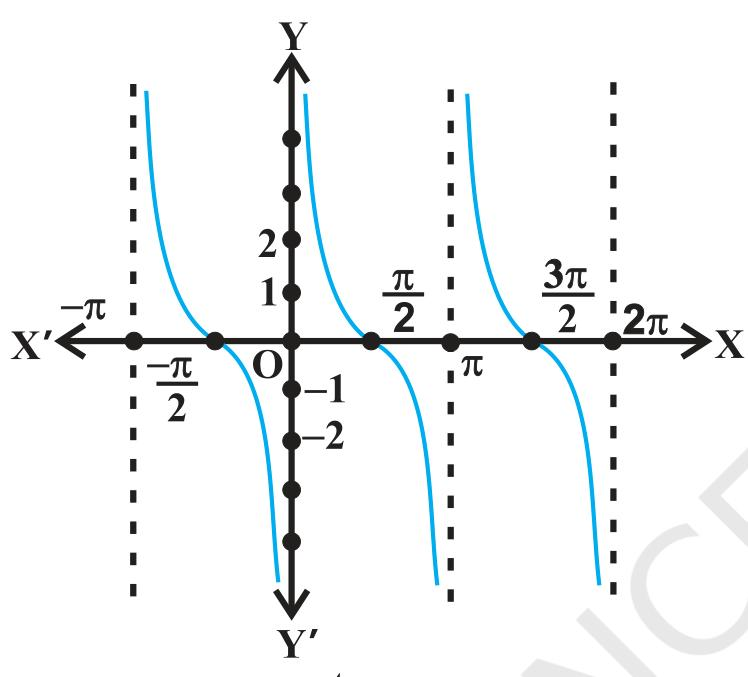

## INVERSE TRIGONOMETRIC FUNCTIONS

Mathematics, in general, is fundamentally the science $o f$ self-evident things — FELIX KLEIN

## 2.1 Introduction

In Chapter 1, we have studied that the inverse of a function $f,$ denoted by $f^{-1}$ , exists if fis one-one and onto. There are many functions which are not one-one, onto or both and hence we can not talk of their inverses. In Class XI, we studied that trigonometric functions are not one-one and onto over their natural domains and ranges and hence their inverses do not exist. In this chapter, we shall study about the restrictions on domains and ranges of trigonometric functions which ensure the existence of their inverses and observe their behaviour through graphical representations. Besides, some elementary properties will also be discussed.

$$
\begin{array} {c} {\mathrm{A r y a b h a t a}} \\ {( 4 7 6 \mathrm{-5 5 0 ~ A. ~ D.} )} \\ \end{array}
$$

The inverse trigonometric functions play an important role in calculus for they serve to define many integrals.

ivesetrionomricfinctins sal usedinsceneand nginern

## 2.2 Basic Concepts

In Class $\mathrm{X I}$ we avesnudedtigonomericfnions, wichaedefined a folos:

sine function, i.e., sine : $\mathbf{R} \to[-1, 1 ]$ 
cosine function, i.e., cos : $\mathbf{R} \to[-1, \, 1 ]$ 
tangent function, i.c., t
$$
\operatorname{a n} : \mathbf{R}-\{x : x=( 2 n+1 ) \, \, \frac{\pi} {2} \,, n \in\mathbf{Z} \} \to\mathbf{R}
$$
cotangent function, ice., cot : $\mathbf{R}-\{\mathbf{x} : x=n \pi, \mathbf{} n \in\mathbf{Z} \} \to\mathbf{R}$ 
secant function, i.e., sec $: \mathbf{R}-\{\, x : x=( 2 n+1 ) \, \, \frac{\pi} {2} \,, \, n \in\mathbf{Z} \} \to\mathbf{R}-(-1, \, 1 )$ cosecant function, i.e., cosec $: \mathbf{R}-\{x : x=n \pi, \, \, \, n \in\mathbf{Z} \} \to\mathbf{R}-(-1, \, 1 )$ We have also learnt in Chapter $1$ that if $f \colon\mathrm{X} \! \to\! \mathrm{Y}$ such that $f ( x )=y$ is one-one and onto, then we can define a unique function $g : \mathrm{Y \to X}$ such that $g ( y )=x$ , where $x \in\mathbf{X}$ and $y=\! f ( x ), \, y \in\Upsilon$ . Here, the domain of $g=$ range of $f$ and the range of $g=$ domain of $f$ . The function $g$ is called the inverse of $f$ and is denoted by $f^{-1}$ . Further, $g$ is also one-one and onto and inverse of $g$ is $f$ Thus, $g^{-1}=( f^{-1} )^{-1}=f.$ We also have

$$
\left( f^{-1} \circ f \right) ( x )=f^{-1} \left( f \left( x \right) \right)=f^{-1} ( y )=x
$$

$$
\mathrm{a n d}
$$

$$
\left( f \circ f^{-1} \right) ( y )=f \left( f^{-1} ( y ) \right)=f ( x )=y
$$

Since the domain of sine function is the set of all real numbers and range is the closed interval $[-1, 1 ]$ . If we restrict its domain $\mathrm{t o} [ \frac{-\pi} {2}, \frac{\pi} {2} \bigg],$ then it becomes one-one and onto with range $[-1, 1 ]$ . Actually, sine function restricted to any of the intervals $\left[ {\frac{-3 \pi} {2}}, \frac{\pi} {2} \right], \left[ {\frac{-\pi} {2}}, \frac{\pi} {2} \right], \left[ {\frac{\pi} {2}}, \frac{3 \pi} {2} \right] \mathrm{e t c.}$ , is one-one and its range $\mathrm{i s ~} [-1, \ 1 ]$ .We can therefore, define the inverse of sine function in each of these intervals. We denote the inverse of sine function by sin (arc sine function). Thus, sinl is a function whose domain is $[-1, 1 ]$ and range could be any of the intervals $\left[ \frac{-3 \pi} {2}, \frac{-\pi} {2} \right], \left[ \frac{-\pi} {2}, \frac{\pi} {2} \right] \mathrm{~ o r ~}$ 
 $\left[ \frac{\pi} {2}, \frac{3 \pi} {2} \right]$ , and so on. Corresponding to each such interval, we get a branch of the function $\operatorname{s i n}^{-1}$ . The branch with range $\left[ \frac{-\pi} {2}, \frac{\pi} {2} \right]$ is called the principal vatue branch whereas other intervals as range give different branches $o f \operatorname{s i n}^{-1}$ . When we refer to the function $\operatorname{s i n}^{-1}$ , we take it as the function whose domain is $[-1, 1 ]$ and range is $\left[ \frac{-\pi} {2}, \frac{\pi} {2} \right]$ . We write $\operatorname{s i n}^{-1} : [-1, ~ 1 ] \to\left[ \frac{-\pi} {2}, \frac{\pi} {2} \right]$ 

From the definition of the inverse functions, it follows that sin $( \operatorname{s i n}^{-1} \, x ) \,=\, x$ 
i
$$
\mathrm{f ~-1 ~ \leq~ x ~ \leq~ 1 ~ a n d ~ s i n^{-1} ~ ( s i n ~ x ) ~=~ x ~ i f ~-~ \frac{\pi} {2} ~ \leq~ x ~ \leq~ \frac{\pi} {2} ~. ~ I n ~ o t h e}
$$
r words, if $y=\operatorname{s i n}^{-1} x,$ . then
sin $y=x$ 

## Remarks

(i） We know from Charter 1, that if $y \!=\! f \! \left( x \right)$ is an invertible function, $x \!=\! f^{-1} \left( y \right)$ Thus, the graph of sin' function can be obtained from the graph of original function by g $x$ and $y$ axes, i.e., if $( a, b )$ is a point on the graph of
interchanging
sine $( b, a )$ becomes the corresponding point on the graph of inverse
function, then

the $y=\operatorname{s i n}^{-1} x$ 州O NSENS市O $x$ and of sine function. Thus, the $y=\operatorname{s i n}^{-1}$ x can be obtained from graph $\mathrm{o f ~} y=\operatorname{s i n} x$ hmnsesaT T .T.re ada sonocthe snpnd
i), (ii), iii).
 $y=\operatorname{s i n}^{-1}$  $x$ represent the principal value branch

(in It can be shown that the graph of an inverse function can be obtained from the corresponding (i.c., reflection) along the line $y=x$ . This can be visualised by looking the graphs of $y=\operatorname{s i n}$  $x$ and $y=\operatorname{s i n}^{-1} x$ as given in the same axes (2i 2 ii)).

$$
\mathrm{F i g ~ 2. 1 ~ ( i )}
$$

$$
\mathrm{F i g \ 2. 1 \ ( i i i )}
$$

$$
\mathrm{F i g ~ 2. 1 ~ ( i i )}
$$

Like sine function, the cosine function is a function whose domain is the set of all real numbers and range is the set $[-1, 1 ]$ . If we restrict the domain of cosine function $\mathrm{t o} \, [ 0, \pi]$ , $[-1, 1 ]$ . Actually, cosine function restricted to any of the intervals 0 , . i r. 2 i etc., is iecivce with range as $[-1, \, 1 ]$ . We can, therefore, define the inverse of cosine function in each of these intervals. We denote the inverse of the cosine function by cos (arc cosine function),

Since, cosec $x=\frac{1} {\operatorname{s i n} x}$ , the domain of the cosec function is the set $\{x : x \in{\bf R}$ and X≠ nT, $n \in{\bf Z} \}$ and the range is the set $\{y : y \in{\bf R}$ , $y \geq1$ or $y \leq-1 \} \mathrm{~ i. e.}$ , the set $R-(-1, ~ 1 )$ . It means that $y=$ cosec $x$ assumes all real values except $- 1 < y < 1$ and is not defined for integral multiple of $\pi$ . If we restrict the domain of cosec function to
 $\left[-\frac{\pi} {2}, \frac{\pi} {2} \right]$ -{0}, then itis one to one and onto with it range as the set $\mathbf{R-} (-1, 1 )$ Atually,
cosec function restricted to any of the i
$$
\mathrm{n t e r v a l s} \, \left[ \frac{-3 \pi} {2}, \frac{-\pi} {2} \right] \!-\{-\pi\} \,, \, \left[ \frac{-\pi} {2}, \frac{\pi} {2} \right]-\{0 \},
$$
$$
\left[ \frac{\pi} {2}, \frac{3 \pi} {2} \right] \!-\left\{\pi\right\}_{\mathrm{\scriptsize~ e t c., ~ i s ~ b i j e c t i v e ~ a n d ~ i t s ~ r a n g e ~ i s ~ t h e ~ s e t ~ o}}
$$
 $R-(-1, ~ 1 )$ .
ali ea numbrs

Thus, cosl is a function whose domain is [-1, 1] and range could be any of the intervals [-n, 0], [O, t], [r, 2t] etc. Corresponding to each such interval, we get a branch of the function cos -. The branch with range $[ 0, \pi]$ is called the principal value branch of the function cosl. We write

$$
\operatorname{c o s}^{-1} : [-1, \, 1 ] \to[ 0, \, \pi].
$$

The graph of the function given $y=\operatorname{c o s}^{-1} x$ can be drawn in the same way as discussed about the graph of y = sin- x. The
givenin Fig $2. 2 \mathrm{~ ( i )}$ and (i)

Let us now discuss and sec-'x as follows:

$$
\mathrm{F i g ~ 2. 2 ~ ( i i )}
$$

Thus cosecrl can be defined as a function whose domain is $R \,-\, (-1, \, 1 )$ and range could be any of the interva $\mathrm{I s} \, \left[ \frac{-3 \pi} {2}, \frac{-\pi} {2} \right] \!-\! \left\{-\pi\right\}, \, \left[ \frac{-\pi} {2}, \frac{\pi} {2} \right] \!-\! \left\{0 \right\}, \, \left[ \frac{\pi} {2}, \frac{3 \pi} {2} \right] \!-\! \left\{\pi\right\} \mathrm{e t c}$ . The function corresponding to the range $\left[ \frac{-\pi} {2}, \frac{\pi} {2} \right]-\left\{0 \right\}$ is caled theprininl atue branch of cosecl. We thus have principal branch as

$$
\mathrm{c o s e c}^{-1} : \mathbf{R}-(-1, \, 1 ) \to\Bigg[ \frac{-\pi} {2}, \frac{\pi} {2} \Bigg]-\{0 \}
$$

The gahs ofy cose ad cose $x$ ae givnin E g 2 (),(i

$$
\mathrm{F i g ~ 2. 3 ~ ( i i )}
$$

$$
\mathrm{F i g ~ 2. 3 ~ ( i )}
$$

Also, since sec $x=\frac{1} {\operatorname{c o s} x}$ , the domain of y= secxis the set ${\bf R}-\{x : x=( 2 n+1 ) \ {\frac{\pi} {2}} \,,$  $n \in{\bf Z} \}$ and range is the set $R-(-1, ~ 1 )$ . It means that sec (secant function) assumes all real values except $- 1 < y < 1$ and is not defined for odd multiples of $\frac{\pi} {2}$ . If we
restrict the domain of secant function to $[ 0, \pi]-\{\ \frac{\pi} {2} \}$ , then it is one-one and onto with its range as the set $R-(-1, ~ 1 )$ . Actually, secant function restricted to any of the intervals $[-\pi, 0 ]-\{\frac{-\pi} {2} \}, \, [ 0, \pi]-\left\{\frac{\pi} {2} \right\}, \, [ \pi]$ 21-cei.isieivendisnage
2
is $\mathbf{R}-\{-1, \, 1 \}$ . Thus sec- can be defined as a function whose domain is $\mathrm{R-} (-1, \, 1 )$ and range could be any of the intervals [- $[ \, \pi, 0 ]-\{\, \frac{-\pi} {2} \, \}, \, [ 0, \pi]-\{\, \frac{\pi} {2} \, \}$ ,[r,2x]- $\{\frac{3 \pi} {2} \}$ etc. Corresponding to each of these intervals, we get different branches of the function sec-l. The branch with range [O, n $- \{\frac{\pi} {2} \}$ is called the principal value branch of the function sec-. We thus have

$$
\mathrm{s e c}^{-1} : \mathbf{R}-(-1, 1 ) \to[ 0, \, \pi]-\{\frac{\pi} {2} \}
$$

The {

gahs ofth functions se and -se' $x$ are given in Fig $2. 4 \mathrm{~ ( i )}$ (i

$$
\mathrm{F i g} \, 2. 4 \, \mathrm{( i i )}
$$

$$
\mathrm{F i g} \, 2. 4 \, \mathrm{( i )}
$$

ianl,we wo disus sarandcor

We know that the domain of the tan function (tangent function) is the set $\{x : x \in{\bf R}$ and $x \neq( 2 n+1 ) \, \, \frac{\pi} {2} \,, \, n \in{\bf Z} \}$ and the range is R. It means that tan function is not defined for odd multiples of $\frac{\pi} {2}$ . If we restrict the domain of tangent function to $\left( \frac{-\pi} {2}, \frac{\pi} {2} \right)$ , then it is one-one and onto with its range as $\mathbf{R}$ . Actually, tangent function restricted to any of the intervals $\left( \frac{-3 \pi} {2}, \frac{-\pi} {2} \right), \, \left( \frac{-\pi} {2}, \frac{\pi} {2} \right), \, \left( \frac{\pi} {2}, \frac{3 \pi} {2} \right) \mathrm{~ e t c.},$ 中Miame and its range is R. Thus tan' can be defined as a function whose domain is $\mathbf R$ 
range could be any of the intervals $\left( \frac{-3 \pi} {2}, \frac{-\pi} {2} \right), \left( \frac{-\pi} {2}, \frac{\pi} {2} \right), \left( \frac{\pi} {2}, \frac{3 \pi} {2} \right)$ and so on. These
intervals give diftrent thnces othe functiontan". The branc with range $\left( \frac{-\pi} {2}, \frac{\pi} {2} \right)$ is called the principal value branch of the function tanl.

The graph ofthe ftntion $y=\operatorname{t a n} x$ and $y=\operatorname{t a n}^{-1} \! x$ are given in Eig $2. 5 \, \, \mathrm{( i )}, \, \mathrm{( i i )}.$ 

We know that domain of the cot function (cotangent function) is the set $\{x : x \in{\bf R}$ a $x \neq n \pi, \, n \in{\bf Z} \}$ and range is $\mathbf{R}$ . It means that cotangent function is not
and 2
defined for integral multiples of . If we restrict the domain of cotangent function to $( 0, \pi)$ , then it is bijective with and its range as $\mathbf{R}$ . In fact, cotangent function restricted to any of the intervals $(-\pi, \, 0 ), \, ( 0, \, \pi), \, ( \pi, \, 2 \pi)$ ) etc., is bijective and its range is $\mathbf R$ . Thus $\operatorname{c o t}^{-1}$ can be defined as a function whose domain is the $\mathbf R$ and range as any of the

$$
\mathrm{W e \ t h u s \ h a v e}
$$

$$
\operatorname{t a n}^{-1} : \mathbf{R} \to\left( \frac{-\pi} {2}, \frac{\pi} {2} \right)
$$

$$
\mathrm{F i g} \, 2. 5 \, ( \mathrm{i} )
$$

$$
\mathrm{F i g} ~ 2. 5 ~ ( \mathrm{i i} )
$$

intervals (-r., 0), (0, ) (r, 2n) etc. These intervals give different branches of the function cot-. The function with range $( 0, \pi)$ is called the principal value branch of the function cot-'. We thus have

$$
\mathrm{c o t}^{-1} : \mathbf{R} \to( 0, \, \pi)
$$

Thegaphs of y ot and ork are gienin ig $2. 6 \, \mathrm{( i )}, \, \mathrm{( i i )}.$ 

$$
y=\operatorname{c o t} x \, \mathrm{F i g} \, 2. 6 \, \mathrm{( i )}
$$

$$
\mathrm{F i g} ~ 2. 6 ~ \mathrm{( i i )}
$$

The following table gives the inverse trigonometric function (principal value branches) along with their domains and ranges.

| sinl |  | 元元 2 2 |
| --- | --- | --- |
| cos- [-1,1] > [O,元] |
| cosecl R-(-1,1) 兀冗 {0 2 2  |
| sec-l R-(-1,1) 一> [0,元]- |
| tanl |  | -兀冗 2 2 |
| cot-1 |  | (O.元) |

## Note

l. sin 'x should not be confused with (sin $x )^{-1}$ . In fact (sin $x )^{-1}=\frac{1} {\operatorname{s i n} x}$ and similarly for other trigonometric functions.

l. sin'x should not be confused with (sin $x )^{-1}$ . In fact $( \operatorname{s i n} \, x )^{-1}=\frac{1} {\operatorname{s i n} x}$ and similarly for other trigonometric functions.
 $2$ . Whenever no branch of an inverse trigonometric functions is mentioned, we mean the principal value branch of that function.
 $3$ . The value $\mathrm{o f}$ an inverse trigonometric functions which lies in the range of principal branch is called the principal value of that inverse trigonometric functions.

3. The value $\mathrm{o f}$ an inverse trigonometric functions which lies in the range of principal branch is called the principal value of that inverse trigonometric functions.

We now consider some examples

Example 1 Find the principal valu of $\operatorname{s i n}^{-1} \left( \frac{1} {\sqrt{2}} \right).$ 
Solution Let $\operatorname{s i n}^{-1} \left( \frac{1} {\sqrt{2}} \right)=y$ . Then, sin $y=\frac{1} {\sqrt{2}}$ 
We know that the range of the principal value branch of sim-h is $\left( \frac{-\pi} {2}, \frac{\pi} {2} \right)$ and $\operatorname{s i n} \! \left( \frac{\pi} {4} \right) \!=\, \frac{1} {\sqrt{2}}$ . Therefore, principal value of sin $\left( \frac{1} {\sqrt{2}} \right) \mathrm{~ i s ~} \frac{\pi} {4}$ 
Example $2$ Find the principal value of cot-l $\left( \frac{-1} {\sqrt{3}} \right)$ 
Solution Let $\mathrm{c o t^{-1}} \left( \frac{-1} {\sqrt{3}} \right)=y. ~ \mathrm{T h e n},$ 
$$
\operatorname{c o t} y=\frac{-1} {\sqrt{3}}=-\operatorname{c o t} \left( \frac{\pi} {3} \right)=\operatorname{c o t} \left( \pi-\frac{\pi} {3} \right)=\operatorname{c o t} \left( \frac{2 \pi} {3} \right)
$$
We know that the range of principal value branch of $\operatorname{c o t}^{-1}$ is $( 0, \, \pi)$ and c $\mathrm{o t} \left( \frac{2 \pi} {3} \right)=\frac{-1} {\sqrt{3}}$ . Hence, principal value of c $\mathrm{o t^{-1}} \left( \frac{-1} {\sqrt{3}} \right) \mathrm{i s} \ \frac{2 \pi} {3}$ 

$$
\mathrm{E x a m p l e ~ 1 ~ F i n d ~ t h e ~ p r i n c i p a l ~ v a l u e ~ o f ~ \operatorname{s i n}^{-1} ~} \left( \frac{1} {\sqrt{2}} \right) \!.
$$

We know that the range of the principal value branch of sin- is $\left( \frac{-\pi} {2}, \frac{\pi} {2} \right)$ and
 $\operatorname{s i n} \! \left( \frac{\pi} {4} \right) \!=\frac{1} {\sqrt{2}}$ . Therefore, principal value of sin $\left( \frac{1} {\sqrt{2}} \right) \mathrm{i s} \ \frac{\pi} {4}$ 

$$
\mathrm{S o l u t i o n ~ L e t ~ c o t^{-1}} \left( \frac{-1} {\sqrt{3}} \right)=y. \ \mathrm{T h e n},
$$

$$
\operatorname{c o t} y=\frac{-1} {\sqrt{3}}=-\operatorname{c o t} \! \left( \frac{\pi} {3} \right)=\operatorname{c o t} \! \left( \pi-\frac{\pi} {3} \right)=\operatorname{c o t} \! \left( \frac{2 \pi} {3} \right)
$$

We know that the range of principal value branch of cotl is (O, n) and C $\mathrm{o t} \left( \frac{2 \pi} {3} \right) \!=\frac{-1} {\sqrt{3}}$ . Hence, principal value of cotl $\left( \frac{-1} {\sqrt{3}} \right) \mathrm{~ i s ~} \frac{2 \pi} {3}$ 

## EXERCISE 2.1

inthepnialalas o tn foloing

1. $\operatorname{s i n}^{-1} \left(-\frac{1} {2} \right)$ 2S 3. cosec-l (2)
2

4
$$
4. ~ ~ \operatorname{t a n}^{-1} ~ (-\sqrt{3} ) ~ ~ ~ ~ ~ ~ ~ ~ ~ ~ ~ ~ ~ ~ ~ ~ ~ ~ ~ ~ ~ ~ ~ ~ ~ ~ ~ ~ ~ ~ ~ ~ ~ ~ ~ ~ ~ ~ ~ ~ ~ ~ ~ ~ ~ ~ ~ ~ ~ ~ ~ ~ ~ ~ ~ ~ ~ ~ ~ ~ ~ ~ ~ ~ ~ ~ ~ ~ ~ ~ ~ ~ ~ ~ ~ ~ ~ ~ ~ ~ ~ ~ ~ ~ ~ ~ ~ ~ ~ ~ ~ ~ ~ ~ ~ ~ ~ ~ ~ ~ ~ ~ ~ ~ ~ ~ ~ ~ ~ ~ ~ ~ ~ ~ ~ ~ ~ ~ ~ ~ ~ ~ ~ ~ ~ ~ ~ ~ ~ ~ ~ ~ ~ ~ ~ ~ ~ ~ ~ ~ ~ ~ ~ ~ ~ ~ ~ ~ ~ ~ ~ ~ ~ ~ ~ ~ ~ ~ ~ ~ ~ ~ ~ ~ ~ ~ ~ ~ ~ ~ ~ ~ ~ ~ ~ ~ ~ ~ ~ ~ ~ ~ ~ ~ ~ ~ ~ ~ ~ ~ ~ ~ ~ ~ ~ ~ ~ ~ ~ ~ ~ ~ ~ ~ ~ ~ ~ ~ ~ ~ ~ ~ ~ ~ ~ ~ ~ ~ ~ ~ ~ ~ ~ ~ ~ ~ ~ ~ ~ ~ ~ ~ ~ ~ ~ ~ ~ ~ ~ ~ ~ ~ ~ ~ ~ ~ ~ ~ ~ ~ ~ ~ ~ ~ ~ ~ ~ ~ ~ ~ ~ ~ ~ ~ ~ ~ ~ ~ ~ ~ ~ ~ ~ ~ ~ ~ ~ ~ ~ ~ ~ ~ ~ ~ ~ ~ ~ ~ ~ ~ ~ ~ ~ ~ ~ ~ ~ ~ ~ ~ ~ ~ ~ ~ ~ ~ ~ ~ ~ ~ ~ ~ ~ ~ ~ ~ ~ ~ ~ ~ ~ ~ ~ ~ ~ ~ ~ ~ ~ ~ ~ ~ ~ ~ ~ ~ ~ ~ ~ ~ ~ ~ ~ ~ ~ ~ ~ ~ ~ ~ ~ ~ ~ ~ ~ ~ ~ ~ ~ ~ ~ ~ ~ ~ ~ ~ ~ ~ ~ ~ ~ ~ ~ ~ ~ ~ ~ ~ ~ ~ ~ ~ ~ ~ ~ ~ ~ ~ ~ ~ ~ ~ ~ ~ ~ ~ ~ ~ ~ ~ ~ ~ ~ ~ ~ ~ ~ ~ ~ ~ ~ ~ ~ ~ ~ ~ ~ ~ ~ ~ ~ ~ ~ ~ ~ ~ ~ ~ ~ ~ ~ ~ ~ ~ ~ ~ ~ ~ ~ ~ ~ ~ ~ ~ ~ ~ ~ ~ ~ ~ ~ ~ ~ ~ ~ ~ ~ ~ ~ ~ ~ ~ ~ ~ ~ ~ ~ ~ ~ ~ ~ ~ ~ ~ ~ ~ ~ ~ ~ ~ ~ ~ ~ ~ ~ ~ ~
$$
6. $\operatorname{t a n}^{-1} \, (-1 )$ 

$$
7. ~ ~ \mathrm{s e c}^{-1} ~ \left( \frac{2} {\sqrt{3}} \right)
$$
$$
8. \; \mathrm{c o t^{-1}} \; ( \sqrt{3} ) \qquad\qquad9. \; \mathrm{c o s}^{-1} \; (-\frac{1} {\sqrt{2}} )
$$

$$
1 0. ~ ~ \mathrm{c o s e c}^{-1} ~ ( \sqrt{2} \ )
$$

indthevalues of thefolowing

11. tan'(
$$
\Delta)+\operatorname{c o s}^{-1} \ \ -\frac{1} {2} \ +\operatorname{s i n}^{-1} \ \ -\frac{1} {2} \qquad\qquad1 2. \ \operatorname{c o s}^{-1} \ \frac{1} {2} \ +2 \ \mathrm{s i n}
$$
n +
1
2

$$
1 3, ~ ~ ~ \mathrm{I f ~ s i n}^{-1} ~ x=y, ~ \mathrm{t h e n}
$$

(A) $0 \leq y \leq\pi$ 
$$
( \mathrm{B} ) \quad-\frac{\pi} {2} \! \leq y \leq\frac{\pi} {2}
$$
(C) $0 < \, y < \pi$ 
$$
{\mathrm{( D )}} \quad-{\frac{\pi} {2}} \! < \! y \! < \! {\frac{\pi} {2}}
$$

14. $\operatorname{t a n}^{-1} \, \sqrt{3}-\operatorname{s e c}^{-1} (-2 )$ is qulto

(A
$$
\mathrm{A ) \; \; \pi~} \qquad\qquad\mathrm{( B ) \; \;-\frac{\pi} {3} ~} \qquad\mathrm{( C ) \; \; \frac{\pi} {3} ~} \qquad\quad\mathrm{( D ) \; \; \frac{2 \pi} {3}}
$$

## 2.3 eTrigonometric Funetions

In this section, we shall prove some important properties of inverse trigonometric functions. It may be mentioned here that these results are valid within the principal value branches of the corresponding inverse trigonometric functions and wherever they are defined. Some results may not be valid for all values of the domains of inverse trigonometric functions. In fact, they will be valid only for some values of x for which inverse trigonometric functions are defined. We will not go into the details of these values of $x$ in the domain as this discussion goes beyond the scope of this textbook.

et us realthat $\mathrm{i f} ~ y=\operatorname{s i n}^{-1} \! x$ t $x=\mathrm{s i}$ iny and if $x=\operatorname{s i n}$  $\mathcal{Y}$ , then $y=\operatorname{s i n}^{-1} \! x$ . This
then
is equivalent to $\textcircled{2}$ 

$$
\operatorname{s i n} \, ( \operatorname{s i n}^{-1} x )=x, \, x \in\ [-1, \, 1 ] \mathrm{~ a n d ~ s i n}^{-1} \, ( \operatorname{s i n} \, x )=x, \, x \in\left[ {\frac{-\pi} {2}}, \, {\frac{\pi} {2}} \right]
$$

For suitable values of domain similar results follow for remaining trigonometric functions.

We now consider some examples.

## Example 3 Show that

4
$$
\mathrm{( i )} \quad\operatorname{s i n}^{-1} \, \left( 2 x \sqrt{1-x^{2} \,} \right)=2 \, \operatorname{s i n}^{-1} \, x, \, \,-\frac{1} {\sqrt{2}} \, {\leq} \, x \, {\leq} \, \frac{1} {\sqrt{2}}
$$
(i $\operatorname{s i n}^{-1} \, \left( 2 x \sqrt{1-x^{2} \,} \right)=2 \, \operatorname{c o s}^{-1} x, \ \frac{1} {\sqrt{2}} \, \leq x \leq1$ 

## Solution

(i）Let $x=\operatorname{s i n}$ 0. Then $\operatorname{s i n}^{-1} \, x=\theta$ . We have

$$
\begin{aligned} {\operatorname{s i n}^{-1} \left( 2 x {\sqrt{1-x^{2}}} \right)} & {{}=\operatorname{s i n}^{-1} \left( 2 \operatorname{s i n} \theta\, {\sqrt{1-\operatorname{s i n}^{2} \theta}} \right)} \\ {} & {{}=\operatorname{s i n}^{-1} \left( 2 \operatorname{s i n} \theta\, \operatorname{c o s} \theta\right)=\operatorname{s i n}^{-1} \left( \operatorname{s i n} 2 \theta\right)=2 \theta} \\ {} & {{}=2 \, \operatorname{s i n}^{-1} x} \\ \end{aligned}
$$

(i）Take $x=\operatorname{c o s} \theta,$ thenpoceding as aboe,we get $\operatorname{s i n}^{-1} \, \left( 2 x \sqrt{1-x^{2} \,} \right)=2 \, \operatorname{c o s}^{-1} x$ 

$$
\Delta\times0. 0
$$

$$
\mathrm{E x a m p l e ~ 4 ~ E x p r e s s ~ \ t a n^{-1} ~ \frac{\operatorname{c o s} x} {1-\operatorname{s i n} x} ~} ~, ~ \frac{-3 \pi} {2} < x < \frac{3} {2}
$$
元 the simplest form.
— 11
2

$$
\textcircled{1}, \textcircled{2}
$$

Solution $\mathrm{W e}$ write

$$
\operatorname{t a n}^{-1} \left( {\frac{\operatorname{c o s} x} {1-\operatorname{s i n} x}} \right)=\operatorname{t a n}^{-1} \left[ {\frac{\operatorname{c o s}^{2} {\frac{x} {2}}-\operatorname{s i n}^{2} {\frac{x} {2}}} {\operatorname{c o s}^{2} {\frac{x} {2}}+\operatorname{s i n}^{2} {\frac{x} {2}}-2 \operatorname{s i n} {\frac{x} {2}} \operatorname{c o s} {\frac{x} {2}}}} \right]
$$

$$
= \operatorname{t a n}^{-1} \left[ \frac{\left( \operatorname{c o s} \frac{x} {2}+\operatorname{s i n} \frac{x} {2} \right) \left( \operatorname{c o s} \frac{x} {2}-\operatorname{s i n} \frac{x} {2} \right)} {\left( \operatorname{c o s} \frac{x} {2}-\operatorname{s i n} \frac{x} {2} \right)^{2}} \right]
$$

$$
\begin{aligned} {} & {{}} & {{}=\tan^{-1} \left[ \frac{\cos\frac{x} {2}+\sin\frac{x} {2}} {2} \right]=\tan^{-1} \! \left[ \frac{1+\tan\frac{x} {2}} {1-\tan\frac{x} {2}} \right]} \\ {} & {{} {}=\tan^{-1} \! \left[ \tan\left( \frac{\pi} {4}+\frac{x} {2} \right) \right]=\frac{\pi} {4}+\frac{x} {2}} \\ \end{aligned}
$$

Example 5 Write $\mathsf{c o t}^{-1} \Bigg( \frac{1} {\sqrt{x^{2}-1}} \Bigg), ~ x > 1$ in the simplest form
Solution Let $x=\operatorname{s e c} \theta$ , then $\sqrt{x^{2}-1}=~ \sqrt{\operatorname{s e c}^{2} \theta-1}=\operatorname{t a n} \theta$ 
Therefore, cot $\sp{-1} \frac{1} {\sqrt{x^{2}-1}}=\mathrm{c o t} \sp{-1} \ ( \mathrm{c o t} \ \theta)=\theta=\mathrm{s e c} \sp{-1} \ x,$ which is the simplest form

Example 5 Write
$$
\mathrm{c o t}^{-1} \! \left( \frac{1} {\sqrt{x^{2}-1}} \right) \!, \ x > 1 \mathrm{~ i n ~ t h e ~ s i m p l e s t ~ f o r m.}
$$

Solution Let $x=\operatorname{s e c} \theta$ , then $\sqrt{x^{2}-1}=~ \sqrt{\operatorname{s e c}^{2} \theta-1}=\operatorname{t a n} \theta$ 

$$
\mathrm{T h e r e f o r e, ~} \mathrm{c o t}^{-1} \frac{1} {\sqrt{x^{2}-1}}=\mathrm{c o t}^{-1} \ ( \mathrm{c o t} \ \theta)=\theta=\mathrm{s e c}^{-1} \ x,
$$
which is the simplest form

## EXERCISE 2.2

$$
\mathrm{P r o v e \: t h e \: f o l l o w i n g :}
$$

二
$$
1. \quad3 \operatorname{s i n}^{-1} x=\operatorname{s i n}^{-1} \, ( 3 x-4 x^{3} ), \ x \in\Biggl[-\frac{1} {2}, \ \frac{1} {2} \Biggr]
$$
2
$$
1. \quad3 \mathrm{c o s}^{-1} \ x=\mathrm{c o s}^{-1} \ ( 4 x^{3}-3 x ), \ x \in\left[ \frac{1} {2}, \ 1 \right]
$$

irthefoloin fntins n ne smiostfiom

3. $\operatorname{t a n}^{-1} \frac{\sqrt{1+x^{2}}-1} {x} \,, \, x \neq0$ tan 1-cosx O<x<元
1+ cosx
5
$$
\operatorname{t a n}^{-1} \left( \frac{\operatorname{c o s} x-\operatorname{s i n} x} {\operatorname{c o s} x+\operatorname{s i n} x} \right), \frac{-\pi} {4} < x < \frac{3 \pi} {4}
$$
( $\zeta. \quad\operatorname{t a n}^{-1} \frac{x} {\sqrt{a^{2}-x^{2}}} \;, \; | x | < a$ 
7. $\operatorname{t a n}^{-1} \left( \frac{3 a^{2} x \!-\! x^{3}} {a^{3} \!-\! 3 a x^{2}} \right), \, a > 0 ; \, \, \frac{-a} {\sqrt{3}} \! < \! x \! < \! \frac{a} {\sqrt{3}}$ ;

3. $\operatorname{t a n}^{-1} \frac{\sqrt{1+x^{2}}-1} {x} \,, \, x \neq0$ 4. tan 1-cosx O<x<元
1+cosx

$$
\ 5 \cdot\quad\operatorname{t a n}^{-1} \left( \frac{\operatorname{c o s} x-\operatorname{s i n} x} {\operatorname{c o s} x+\operatorname{s i n} x} \right), \frac{-\pi} {4} < x < \frac{3 \pi} {4}
$$

$$
6. \quad\operatorname{t a n}^{-1} \frac{x} {\sqrt{a^{2}-x^{2}}} \,, \, | x | < a
$$

$$
\mathrm{7.} \quad\operatorname{t a n}^{-1} \left( \frac{3 a^{2} x \!-\! x^{3}} {a^{3} \!-\! 3 a x^{2}} \right), \, a > 0 ; \, \, \frac{-a} {\sqrt{3}} \! < \! x \! < \! \frac{a} {\sqrt{3}}
$$

inthe valosofah ofthefoloing

$$
8. ~ ~ \operatorname{t a n}^{-1} [ 2 \operatorname{c o s} \biggl( 2 \operatorname{s i n}^{-1} \frac1 2 \biggr) ]
$$

$$
9. \quad\operatorname{t a n} \frac{1} {2} \Bigg[ \operatorname{s i n}^{-1} \frac{2 x} {1+x^{2}}+\operatorname{c o s}^{-1} \frac{1-y^{2}} {1+y^{2}} \Bigg], \, | \, x \, | <
$$
1,y>0and xy<

Find the values of each of the expressions in Exercises 16 to $1 8$ .

$$
1 0. ~ ~ \operatorname{s i n}^{-1} \left( \operatorname{s i n} \frac{2 \pi} {3} \right)
$$
$$
1 1. ~ ~ \operatorname{t a n}^{-1} ( \operatorname{t a n} \frac{3 \pi} {4} )
$$

$$
1 2. ~ ~ ~ \operatorname{t a n} \2 \operatorname{s i n}^{-1} \frac{3} {5}+\operatorname{c o t}^{-1} \frac{3} {2} )
$$

$$
1 \, 3 \,. ~ ~ \operatorname{c o s}^{-1} \left( \operatorname{c o s} \frac{7 \pi} {6} \right) \mathrm{i s ~ e q u a l ~ t o}
$$

$$
\mathrm{( A ) \; \; \; \frac{7 \pi} {6} \; ~} ~ ~ ~ ~ ~ ~ ~ ~ ~ ~ ~ ~ ~ ~ ~ ~ ~ ~ ~ ~ ~ ~ ~ ~ ~ ~ ~ ~ ~ ~ ~ ~ ~ ~ ~ ~ ~ ~ ~ ~ ~ ~ ~ ~ ~ ~ ~ ~ ~ ~ ~ ~ ~ ~ ~ ~ ~ ~ ~ ~ ~ ~ ~ ~ ~ ~ ~ ~ ~ ~ ~ ~ ~ ~ ~ ~ ~ ~ ~ ~ ~ ~ ~ ~ ~ ~ ~ ~ ~ ~ ~ ~ ~ ~ ~ ~ ~ ~ ~ ~ ~ ~ ~ ~ ~ ~ ~ ~ ~ ~ ~ ~ ~ ~ ~ ~ ~ ~ ~ ~ ~ ~ ~ ~ ~ ~ ~ ~ ~ ~ ~ ~ ~ ~ ~ ~ ~ ~ ~ ~ ~ ~ ~ ~ ~ ~ ~ ~ ~ ~ ~ ~ ~ ~ ~ ~ ~ ~ ~ ~ ~ ~ ~ ~ ~ ~ ~ ~ ~ ~ ~ ~ ~ ~ ~ ~ ~ ~ ~ ~ ~ ~ ~ ~ ~ ~ ~ ~ ~ ~ ~ ~ ~ ~ ~ ~ ~ ~ ~ ~ ~ ~ ~ ~ ~ ~ ~ ~ ~ ~ ~ ~ ~ ~ ~ ~ ~ ~ ~ ~ ~ ~ ~ ~ ~ ~ ~ ~ ~ ~ ~ ~ ~ ~ ~ ~ ~ ~ ~ ~ ~ ~ ~ ~ ~ ~ ~ ~ ~ ~ ~ ~ ~ ~ ~ ~ ~ ~ ~ ~ ~ ~ ~ ~ ~ ~ ~ ~ ~ ~ ~ ~ ~ ~ ~ ~ ~ ~ ~ ~ ~ ~ ~ ~ ~ ~ ~ ~ ~ ~ ~ ~ ~ ~ ~ ~ ~ ~ ~ ~ ~ ~ ~ ~ ~ ~ ~ ~ ~ ~ ~ ~ ~ ~ ~ ~ ~ ~ ~ ~ ~ ~ ~ ~ ~ ~ ~ ~ ~ ~ ~ ~ ~ ~ ~ ~ ~ ~ ~ ~ ~ ~ ~ ~ ~ ~ ~ ~ ~ ~ ~ ~ ~ ~ ~ ~ ~ ~ ~ ~ ~ ~ ~ ~ ~ ~ ~ ~ ~ ~ ~ ~ ~ ~ ~ ~ ~ ~ ~ ~ ~ ~ ~ ~ ~ ~ ~ ~ ~ ~ ~ ~ ~ ~ ~ ~ ~ ~ ~ ~ ~ ~ ~ ~ ~ ~ ~ ~ ~ ~ ~ ~ ~ ~ ~ ~ ~ ~ ~ ~ ~ ~ ~ ~ ~ ~ ~ ~ ~ ~ ~ ~ ~ ~ ~ ~ ~ ~ ~ ~ ~ ~ ~ ~ ~ ~ ~ ~ ~ ~ ~ ~ ~ ~ ~ ~ ~ ~ ~ ~ ~ ~ ~ ~ ~ ~ ~ ~ ~ ~ ~ ~ ~ ~ ~ ~ ~ ~ ~ ~ ~ ~ ~ ~ ~ ~ ~ ~ ~ ~
$$

14
$$
\mathrm{t.} \quad\operatorname{s i n} \! \left( \frac{\pi} {3} \!-\! \operatorname{s i n}^{-1} (-\frac{1} {2} ) \right) \mathrm{~ i s ~ e q u a l ~ t o}
$$

$$
\mathrm{( A ) \; \; \; \frac{1} {2} \; \; \; \; \; \; \; \; \; \; \; \; \; \; \; \; \; \; \; ( B ) \; \; \; \frac{1} {3} \; \; \; \; \; \; \; \; \; \; \; \; \; \; \; \; \; \; \; \; \; \; \; \; \; \; \; \; \; \; \; \; \; \; \; \; \; \; \; \; \; \; \; \; \; \; \; \; \; \; \; \; \; \; \; \; \; \; \; \; \; \; \; \; \; \; \; \; \; \; \; \; \; \; \; \; \; \; \; \; \; \; \; \; \; \; \; \; \; \; \; \; \; \; \; \; \; \; \; \; \; \; \; \; \; \; \; \; \; \; \; \; \; \; \; \; \; \; \; \; \; \; \; \; \; \; \; \; \; \; \; \; \; \; \; \; \; \; \; \; \; \; \; \; \; \; \; \; \; \; \; \; \; \; \; \; \; \; \; \; \; \; \; \; \; \; \; \; \; \; \; \; \; \; \; \; \; \; \; \; \; \; \; \; \; \; \; \; \; \; \; \; \; \; \; \; \; \; \; \; \; \; \; \; \; \; \; \; \; \; \; \; \; \; \; \; \; \; \; \; \; \; \; \; \; \; \; \; \; \; \; \; \; \; \; \; \; \; \; \; \; \; \; \; \; \; \; \; \; \; \; \; \; \; \; \; \; \; \; \; \; \; \; \; \; \; \; \; \; \; \; \; \; \; \; \; \; \; \; \; \; \; \; \; \; \; \; \; \; \; \; \; \; \; \; \; \; \; \; \; \; \; \; \; \; \; \; \; \; \; \; \; \; \; \; \; \; \; \; \; \; \; \; \; \; \; \; \; \; \; \; \; \; \; \; \; \; \; \; \; \; \; \; \; \; \; \; \; \; \; \; \; \; \; \; \; \; \; \; \; \; \; \; \; \; \; \; \; \; \; \; \; \; \; \; \; \; \; \; \; \; \; \; \; \; \; \; \; \; \; \; \; \; \; \; \; \; \; \; \; \; \; \; \; \; \; \; \; \; \; \; \; \; \; \; \; \; \;scriptstyle \scriptstyle\scriptstyle\scriptstyle\scriptstyle\ 7 7 7 7 7 7 7 7 7 7 7 7 7 7 7 7 7 7 7 7 7 7 7 7 7 7 7 7 7 7 7 7 7 7
$$

15. $\operatorname{t a n}^{-1} \sqrt{3}-\operatorname{c o t}^{-1} (-\sqrt{3} ) \, \mathrm{~ i s ~ e q u a l ~ t o}$ 

(A）元 (B) 兀 (C) 0 (D）2/3
2

## Miscellaneous Examples

KamecGindhesuneo snrsn2
5

Sontione knowthat $\operatorname{s i n}^{-1} ( \operatorname{s i n} x )=x$ .Thetore $\operatorname{s i n}^{-1} ( \operatorname{s i n} \frac{3 \pi} {5} )=\frac{3 \pi} {5}$ But $\frac{3 \pi} {5} \not\in\left[-\frac{\pi} {2}, \frac{\pi} {2} \right]$ , which is the principal branch of sin' x
Therefore sin
$$
\begin{array} {l} {{( \displaystyle{\frac{3 \pi} {5}} )=\sin( \pi-{\frac{3 \pi} {5}} )=\sin{\frac{2 \pi} {5}} ~ \mathrm{a n d} ~ {\frac{2 \pi} {5}} \in\left[-{\frac{\pi} {2}}, {\frac{\pi} {2}} \right]}} \\ {{{}^{1} ( \sin{\frac{3 \pi} {5}} )=\sin^{-1} ( \sin{\frac{2 \pi} {5}} )={\frac{2 \pi} {5}}}} \end{array}
$$
However s1n

## Miscellaneous Exercie nChapter 2

indthevalueofthefolong

$$
1. \quad\operatorname{c o s}^{-1} \left( \operatorname{c o s} \frac{1 3 \pi} {6} \right) \qquad\qquad\qquad\qquad2. \quad\operatorname{t a n}^{-1} \left( \operatorname{t a n} \frac{7 \pi} {6} \right)
$$

$$
2. ~ ~ \operatorname{t a n}^{-1} ( \operatorname{t a n} \frac{7 \pi} {6} )
$$

$$
\mathrm{P r o v e \ t h a t}
$$

3. $2 \operatorname{s i n}^{-1} \frac{3} {5}=\operatorname{t a n}^{-1} \frac{2 4} {7}$ 4. $\operatorname{s i n}^{-1} \frac{8} {1 7}+\operatorname{s i n}^{-1} \frac{3} {5}=\operatorname{t a n}^{-1} \frac{7 7} {3 6}$ 
5. $\operatorname{c o s}^{-1} \frac{4} {5}+\operatorname{c o s}^{-1} \frac{1 2} {1 3}=\operatorname{c o s}^{-1} \frac{3 3} {6 5}$ 6. $\operatorname{c o s}^{-1} \frac{1 2} {1 3}+\operatorname{s i n}^{-1} \frac{3} {5}=\operatorname{s i n}^{-1} \frac{5 6} {6 5}$ 
7。 $\operatorname{t a n}^{-1} \frac{6 3} {1 6}=\operatorname{s i n}^{-1} \frac{5} {1 3}+\operatorname{c o s}^{-1} \frac{3} {5}$ 

$$
3. \quad2 \operatorname{s i n}^{-1} \frac{3} {5}=\operatorname{t a n}^{-1} \frac{2 4} {7}
$$
$$
4. \quad\operatorname{s i n}^{-1} \frac{8} {1 7}+\operatorname{s i n}^{-1} \frac{3} {5}=\operatorname{t a n}^{-1} \frac{7 7} {3 6}
$$

$$
4. \quad\operatorname{s i n}^{-1} \frac{8} {1 7}+\operatorname{s i n}^{-1} \frac{3} {5}=\operatorname{t a n}^{-1} \frac{7 7} {3 6}
$$

5. $\operatorname{c o s}^{-1} \frac{4} {5}+\operatorname{c o s}^{-1} \frac{1 2} {1 3}=\operatorname{c o s}^{-1} \frac{3 3} {6 5}$ 6. $\operatorname{c o s}^{-1} \frac{1 2} {1 3}+\operatorname{s i n}^{-1} \frac{3} {5}=\operatorname{s i n}^{-1} \frac{5 6} {6 5}$ 

$$
5. ~ ~ ~ \operatorname{c o s}^{-1} \frac{4} {5}+\operatorname{c o s}^{-1} \frac{1 2} {1 3}=\operatorname{c o s}^{-1} \frac{3 3} {6 5}
$$

$$
6. ~ ~ ~ \operatorname{c o s}^{-1} \frac{1 2} {1 3}+\operatorname{s i n}^{-1} \frac3 5=\operatorname{s i n}^{-1} \frac{5 6} {6 5}
$$

$$
7. ~ ~ ~ \operatorname{t a n}^{-1} \frac{6 3} {1 6}=\operatorname{s i n}^{-1} \frac{5} {1 3}+\operatorname{c o s}^{-1} \frac3 5
$$

$$
\mathrm{P r o v e \ t h a t}
$$

8 $\operatorname{t a n}^{-1} \sqrt{x}=\frac{1} {2} \operatorname{c o s}^{-1} \ \frac{1-x} {1+x} \ \, x \in[ 0, \, 1 ]$ 

$$
9. \quad\operatorname{c o t}^{-1} \left( \frac{\sqrt{1+\operatorname{s i n} x}+\sqrt{1-\operatorname{s i n} x}} {\sqrt{1+\operatorname{s i n} x}-\sqrt{1-\operatorname{s i n} x}} \right)=\frac{x} {2} \,, \; x \in\left( 0, \frac{\pi} {4} \right)
$$

10. $\operatorname{t a n}^{-1} \left( \frac{\sqrt{1+x}-\sqrt{1-x}} {\sqrt{1+x}+\sqrt{1-x}} \right)=\frac{\pi} {4}-\frac{1} {2} \operatorname{c o s}^{-1} x \,, \,-\frac{1} {\sqrt{2}} \leq x$ : 1 [Hint: Put $x=\operatorname{c o s} 2 \theta]$ Solve the following equations:

11. 2tan'(c
$$
\cos\, x )=\tan^{-1} \, ( 2 \, \mathrm{c o s e c} \, \, x ) \quad1 2 \,. \quad\tan^{-1} \frac{1-x} {1+x} {=} \frac{1} {2} \tan^{-1} x, ( x )
$$
:>0)

$$
1 3, ~ ~ \operatorname{s i n} ( \operatorname{t a n}^{-1} x ), | x | < 1 ~ \mathrm{i s ~ e q u a l ~ t o}
$$

$$
\mathrm{( A )} \; \; {\frac{x} {\sqrt{1-x^{2}}}} \; \; \; \; \; \; \; \; \; \; \mathrm{( B )} \; \; {\frac{1} {\sqrt{1-x^{2}}}} \; \; \; \; \; \mathrm{( C )} \; \; {\frac{1} {\sqrt{1}}}
$$
+x2 D
1 X

14. $\operatorname{s i n}^{-1} ( 1-x )-2 \, \operatorname{s i n}^{-1} x=\frac{\pi} {2} \,, \mathrm{t h e n} ~ x \mathrm{~ i s ~ e q u a l ~ t o}$ 0

(A) 0, $\frac{1} {2}$ (B）1, $\frac{1} {2}$ (C)0 D $\frac{1} {2}$ ## Summary

The domains and ranges (principal value branches) of inverse trigonometric functions are given in the following table:

| Functions | Domain |  Range (Principal Value Branches |
| --- | --- | --- |
| y = sin x | [-1, 1] | 一元兀 2 2 |
| y = cos x | [-1, 1] | [0, n] |
| y = sec-l x R-(-1, 1) [0, T] TU 2 |
| y = tan-' x R 2 元 元 2 |
| y= cotl x | R | (O,元) |

sin'x should not be confused with $( \operatorname{s i n} x )^{-1}$ . In fact (sin $x )^{-1}=\frac{1} {\operatorname{s i n} x}$ and similarly for other trigonometric functions.

The value of an inverse trigonometric functions which lies in its principal value branch is called the principal value of that inverse trigonometric functions.

For suitble valusof comin, we have

 $y=\operatorname{s i n}^{-1} x \Rightarrow x=\operatorname{s i n} y$ 
$$
\begin{array} {l l} {\hat{\Leftrightarrow}} & {x=\operatorname{s i n} y \ \Rightarrow y=\operatorname{s i n}^{-1} x} \\ {\hat{\phi}} & {\operatorname{s i n}^{-1} {( \operatorname{s i n} x )}=x} \\ \end{array}
$$
 $\operatorname{s i n} \left( \operatorname{s i n}^{-1} x \right)=x$ 

$$
\begin{array} {l l} {\diamond} & {x=\operatorname{s i n} y \ \Rightarrow y=\operatorname{s i n}^{-1} x} \\ {\diamond} & {\operatorname{s i n}^{-1} \left( \operatorname{s i n} x \right)=x} \\ \end{array}
$$

## Historical Note

The study of trigonometry was first started in India. The ancient Indian Mathematicians, Aryabhata $( 4 7 6 \mathrm{A. D.} )$ , Brahmagupta $( 5 9 8 \ \mathrm{A. D.} )$ , Bhaskara $\mathrm{I}$  $( 6 0 0 \, \mathrm{A. D.} )$ and Bhaskara $\mathrm{I I \, (} 1 1 1 4 \, \mathrm{A. D. )}$ got important results $\mathrm{o f}$ trigonometry. $\mathrm{A l l}$ this knowledge went from India to Arabia and then from there to Europe. The Greeks had also started the study of trigonometry but their approach was so clumsy that when the Indian approach became known, it was immediately adopted throughout the world.

In India, the predecessor of the modern trigonometric functions, known as the sine $\mathrm{o f}$ an angle, and the introduction of the sine function represents one $\mathrm{o f}$ the main contribution of the siddhantas (Sanskrit astronomical works) to mathematics.

Bhaskara $\mathrm{I \, ( a b o u t \, 6 0 0 \, A. D. )}$ gave formulae to find the values of sine functions for angles more than $9 0^{\circ}. \mathrm{~ A}$ sixteenth century Malayalam work Yuktibhasa contains a proof for the expansion of sin $\mathrm{( A+B )}$ ). Exact expression for sines or cosines of $1 8^{\circ}, 3 6^{\circ}, 5 4^{\circ}, 7 2^{\circ},$ .etc., were given by Bhaskara Il

The symbols sin $x$ ,cos- $x$ etc., forar sin $x$ arc cos x, etc., were sugested by the astronomer Sir John $\mathrm{F. W}$ . Hersehel $( 1 8 1 3 )$ The name of Thales about 600 $\mathrm{B. C.} )$ is invariably associated with height and distance problems. He is credited with the determination of the height $\mathrm{o f ~ a}$ great pyramid in Egypt by measuring shadows of the pyramid and an auxiliary staff (or gnomon) of known height, and comparing the ratios:

$$
{\frac{\mathrm{H}} {\mathrm{S}}}={\frac{h} {s}} \,=\operatorname{t a n} \, ( \mathrm{s u n^{,} s ~ a l t i t u d e} )
$$

Thales is also said to have calculated the distance of a ship at sea through the proportionality of sides of similar triangles. Problems on height and distance using the similarity property are also found in ancicnt Indian works.
